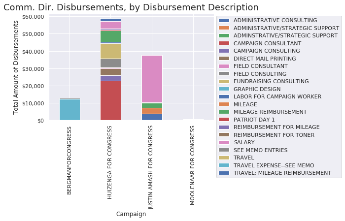
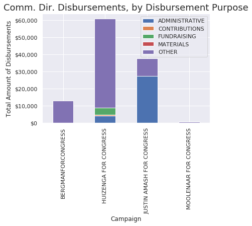

# MI Representative Communications Director Disbursements

Sat, Nov 16, 2019.

>> In a statement Friday, Huizenga's spokesman, **Brian Patrick**, called the accusations a "false narrative created by the Michigan Democratic Party" and said the congressman "eagerly" awaits a final resolution to questions first raised more than a year ago.

- [Mich. lawmaker used campaign funds for Disney trips. Now ethics committee has questions.](https://www.freep.com/story/news/local/michigan/2019/11/15/rep-bill-huizenga-ethics-committee-campaign-spending/4201875002/) [Detroit Free Press]

>> "...Nancy Pelosi's foot soldiers produced a partisan report that continues the false narrative created by the Michigan Democratic Party," said Huizenga's Communications Director **Brian Patrick**. 

- [Ethics investigation into Rep. Bill Huizenga continues](https://www.wzzm13.com/article/news/politics/michigan-politics/ethics-investigation-bill-huizenga/69-979a822d-93e4-40f8-8934-aa76aeb1af83)


```python
from __init import *
df = pd.read_csv(
    filepath_or_buffer="mi_rep_all_disbursement_data.csv.gz",
    compression="gzip",
    header=0,
)
# Load Reps from congress.org
reps = lookup.load_reps()
# Get MI Reps.
mi = [rep for rep in reps if rep.state_abbr == "MI"]
mi_reps = [rep for rep in mi if rep.house]
mi_reps
```


    [Rep<Justin Amash (I), MI-3rd>,
     Rep<Jack Bergman (R), MI-1st>,
     Rep<Debbie Dingell (D), MI-12th>,
     Rep<Bill Huizenga (R), MI-2nd>,
     Rep<Dan Kildee (D), MI-5th>,
     Rep<Brenda Lawrence (D), MI-14th>,
     Rep<Andy Levin (D), MI-9th>,
     Rep<Paul Mitchell (R), MI-10th>,
     Rep<John Moolenaar (R), MI-4th>,
     Rep<Elissa Slotkin (D), MI-8th>,
     Rep<Haley Stevens (D), MI-11th>,
     Rep<Rashida Tlaib (D), MI-13th>,
     Rep<Fred Upton (R), MI-6th>,
     Rep<Tim Walberg (R), MI-7th>]


```python
# For Communication Director
position = "Comm. Dir."
df2 = pd.DataFrame(columns=df.columns)
for rep in mi_reps:
    try: 
        staffer_name = HumanName(rep.staffers[position])
    except:
        try:
            staffer_name = HumanName(rep.staffers[f"Acting {position}"])
        except:
            # Staffers that don't have that position filled.
            print(f"# No {position}: {rep.name} ({rep.party})")
            continue
    df_tmp = df[
        df.recipient_name.str.contains(staffer_name.last.upper()) &
        df.committee_name.str.contains(rep.last_name.upper())
    ]
    df_tmp = df_tmp.reset_index()
    if len(df_tmp)>0:
        print(f"## {rep.name} ({rep.party}) - {position} [{staffer_name}, {len(df_tmp)} disbursements]")
        df2 = df2.append(df_tmp)
```

    ## Justin Amash (I) - Comm. Dir. [Poppy Nelson, 20 disbursements]
    ## Jack Bergman (R) - Comm. Dir. [James Hogge, 10 disbursements]
    # No Comm. Dir.: Debbie Dingell (D)
    ## Bill Huizenga (R) - Comm. Dir. [Brian Patrick, 83 disbursements]
    ## John Moolenaar (R) - Comm. Dir. [David Russell, 2 disbursements]
    # No Comm. Dir.: Elissa Slotkin (D)
    # No Comm. Dir.: Haley Stevens (D)


Total Disbursements to Communications Director by committee name.


```python
df2.groupby(['committee_name']).sum()["disbursement_amount"]
```


    committee_name
    BERGMANFORCONGRESS           12900.32
    HUIZENGA FOR CONGRESS        60939.51
    JUSTIN AMASH FOR CONGRESS    37685.17
    MOOLENAAR FOR CONGRESS         468.53
    Name: disbursement_amount, dtype: float64


## Communications Director Disbursement Descriptions

>> Generally, all the individuals interviewed stated that the campaign had no written or generally known policies or procedures related to how funds are spent or reimbursed. 25 As the Chief of Staff put it, “[w]e don’t have a written policy. I mean basically everybody’s on the honor system. . . . If you made an expense, you’d get reimbursed.”


```python
_tmp = df2.groupby(['committee_name', 'disbursement_description']).sum()["disbursement_amount"]
_tmp
```


    committee_name             disbursement_description        
    BERGMANFORCONGRESS         GRAPHIC DESIGN                      12362.06
                               SEE MEMO ENTRIES                      538.26
    HUIZENGA FOR CONGRESS      CAMPAIGN CONSULTANT                 22837.98
                               CAMPAIGN CONSULTING                  3000.00
                               DIRECT MAIL PRINTING                 4195.00
                               FIELD CONSULTANT                      500.00
                               FIELD CONSULTING                     5055.00
                               FUNDRAISING CONSULTING               8966.32
                               LABOR FOR CAMPAIGN WORKER             750.00
                               MILEAGE REIMBURSEMENT                6577.10
                               PATRIOT DAY 1                         500.00
                               REIMBURSEMENT FOR MILEAGE             454.09
                               SALARY                               4260.60
                               TRAVEL: MILEAGE REIMBURSEMENT        1843.42
    JUSTIN AMASH FOR CONGRESS  ADMINISTRATIVE CONSULTING            3805.41
                               ADMINISTRATIVE/STRATEGIC SUPPORT     3436.03
                               ADMINSTRATIVE/STRATEGIC SUPPORT      2872.06
                               REIMBURSEMENT FOR TONER               116.58
                               SALARY                              27287.50
                               TRAVEL                                 12.50
                               TRAVEL EXPENSE--SEE MEMO              155.09
    MOOLENAAR FOR CONGRESS     MILEAGE                               208.53
                               MILEAGE REIMBURSEMENT                 260.00
    Name: disbursement_amount, dtype: float64


```python
ax = _tmp.unstack().plot(kind='bar', stacked=True)
plt.xlabel("Campaign")
fmt = '${x:,.0f}'
tick = mtick.StrMethodFormatter(fmt)
ax.yaxis.set_major_formatter(tick) 
plt.ylabel("Total Amount of Disbursements")
plt.title(f"{position} Disbursements, by Disbursement Description")
plt.legend(loc='bottom left', bbox_to_anchor=(1.0, 1))
```


    <matplotlib.legend.Legend at 0x7f27d1ee5a90>





>> “The definition of the term contribution in the FECA is quite detailed . . . [U]nder FEC regulations, most outlays that an individual makes on behalf of a campaign are deemed to be a contribution to that campaign from that individual. This is so even if it is intended that the campaign will reimburse the individual promptly. The major exception to this rule is for
outlays that an individual makes to cover expenses that he or she incurs in traveling on behalf of a campaign.” Assuming certain travel outlays are reimbursed within specified time periods, they will not be considered “contributions.”


```python
_tmp = df2.groupby(['committee_name', 'disbursement_purpose_category']).sum()["disbursement_amount"]
_tmp
```


    committee_name             disbursement_purpose_category
    BERGMANFORCONGRESS         OTHER                            12900.32
    HUIZENGA FOR CONGRESS      ADMINISTRATIVE                    4260.60
                               CONTRIBUTIONS                      500.00
                               FUNDRAISING                       4195.00
                               OTHER                            51983.91
    JUSTIN AMASH FOR CONGRESS  ADMINISTRATIVE                   27287.50
                               MATERIALS                          155.09
                               OTHER                            10242.58
    MOOLENAAR FOR CONGRESS     OTHER                              468.53
    Name: disbursement_amount, dtype: float64


```python
ax = _tmp.unstack().plot(kind='bar', stacked=True)
plt.xlabel("Campaign")
fmt = '${x:,.0f}'
tick = mtick.StrMethodFormatter(fmt)
ax.yaxis.set_major_formatter(tick) 
plt.ylabel("Total Amount of Disbursements")
plt.title(f"{position} Disbursements, by Disbursement Purpose")
plt.legend(loc='bottom left', bbox_to_anchor=(1.0, 1))
```


    <matplotlib.legend.Legend at 0x7f27d1d7a0b8>




