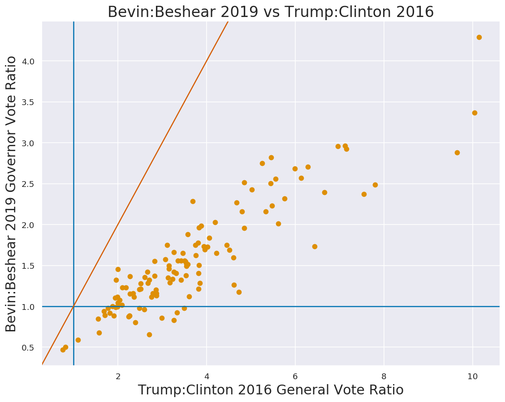
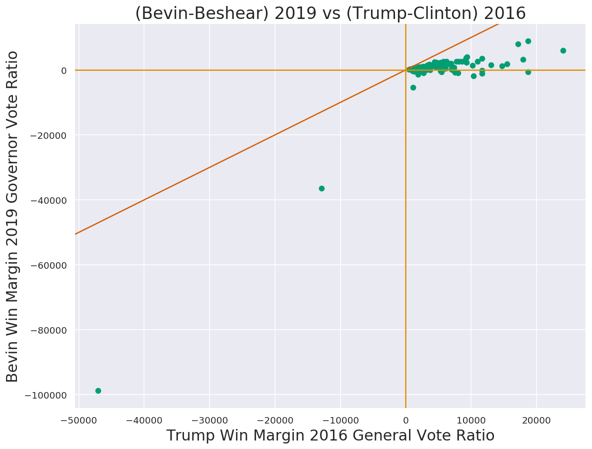
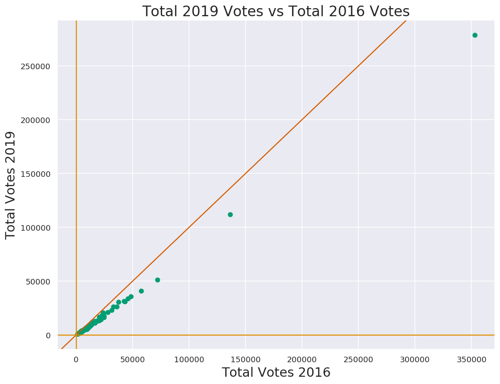
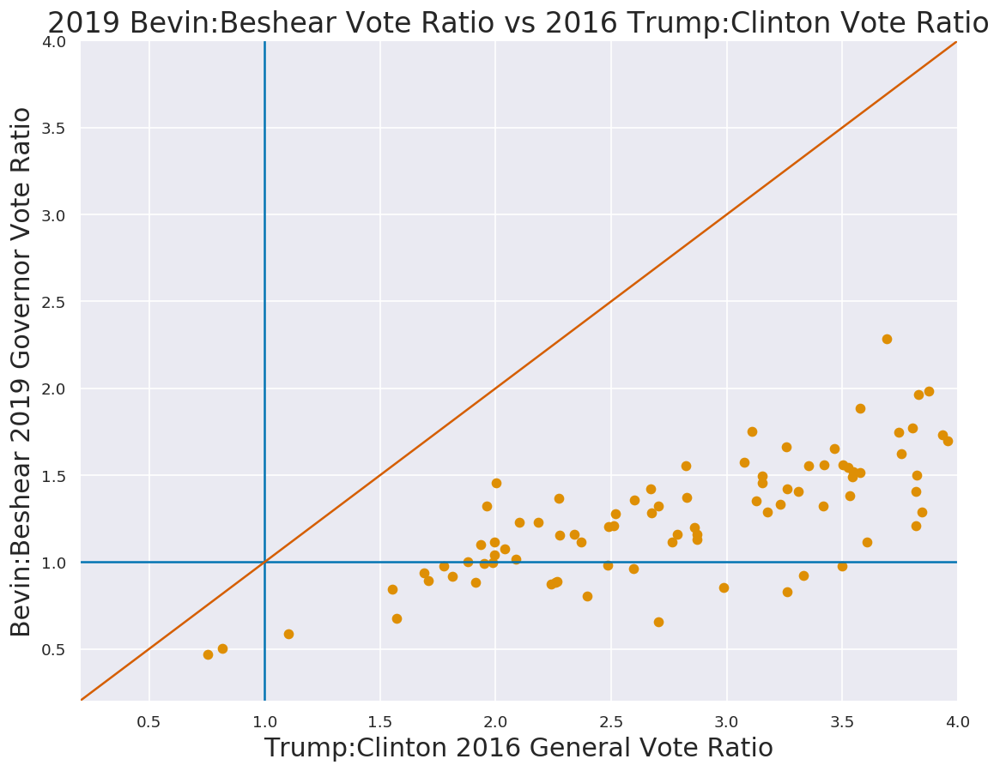
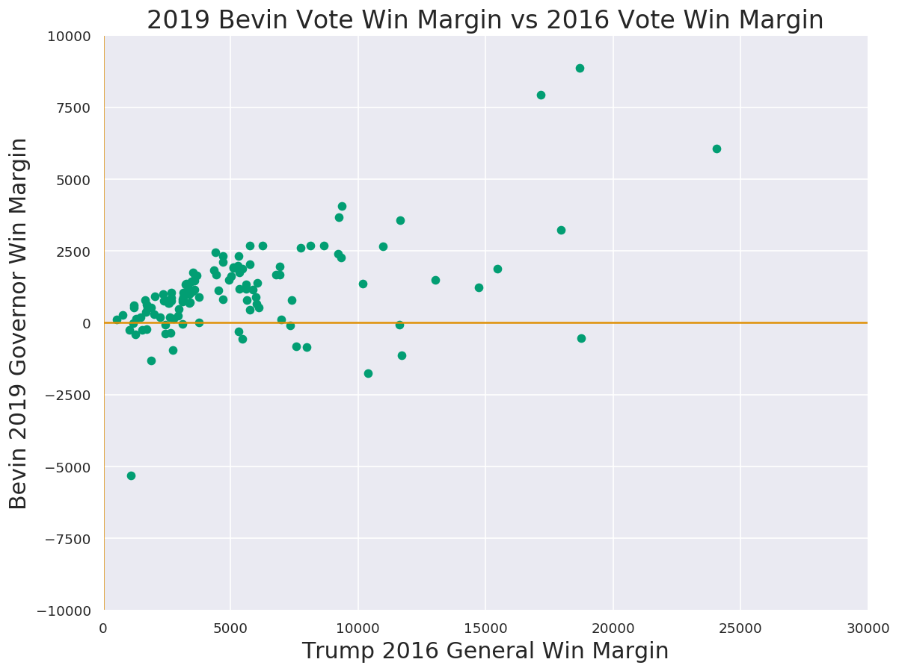

# Kentucky Elections

Quick look at Kentucky's elections for how 2020 MI-02 may play out.

### Source Data

The New York Times.

- [2019 - Kentucky Governor Election Results](https://www.nytimes.com/interactive/2019/11/05/us/elections/results-kentucky-governor-general-election.html)
- [2016 - Kentucky Presidential Election Results](https://www.nytimes.com/elections/2016/results/kentucky)
- [2016 - Kentucky Presidential Primary Results](https://www.nytimes.com/elections/2016/results/primaries/kentucky)

Data is in the source in JSON format, pulled out and prettified. 


```python
import json
import numpy as np
import pandas as pd
import seaborn as sns
import os
import matplotlib.pyplot as plt
import matplotlib as mpl
%matplotlib inline
```


```python
# Do not join cells.
# https://stackoverflow.com/questions/332289/how-do-you-change-the-size-of-figures-drawn-with-matplotlib#comment87590438_41717533
sns.set(rc={
    'axes.labelsize': 18,
    'axes.titlesize': 20,
    'figure.figsize': (11, 8.5),
    'figure.dpi': 120,
    "figure.facecolor": "w",
    "figure.edgecolor": "k",
});

current_palette = sns.color_palette("colorblind", 4);
sns.palplot(current_palette);
```


```python
# Load the data
with open("kentucky_primary_2016.json", "rb") as fid:
    kentucky_primary_2016= json.load(fid)
kentucky_primary_2016_gop = kentucky_primary_2016[0]
kentucky_primary_2016_dnc = kentucky_primary_2016[1]
with open("kentucky_general_2016.json", "rb") as fid:
    kentucky_general_2016 = json.load(fid)
with open("kentucky_governor_2019.json", "rb") as fid:
    kentucky_governor_2019= json.load(fid)
```


```python
# Despite ranking 37th in size by area, Kentucky has 120 counties;
# Source: Wiki.
# Sanity Check.
assert len(kentucky_primary_2016_gop["counties"]) == 120
assert len(kentucky_primary_2016_dnc["counties"]) == 120
assert len(kentucky_general_2016[0]["counties"]) == 120
assert len(kentucky_primary_2016_dnc["counties"]) == 120
```


```python
# Merge the data.
results = dict()
# For each county in the governor's race
for county in kentucky_governor_2019["counties"]:
    # Create an empty dict for the county name.
    results[county["name"]]=dict()
    # Copy the FIPS
    results[county["name"]]["fips"]=county["fips"]
    # Loop through each candidate
    for candidate, votes in county["results"].items():
        results[county["name"]][candidate]=votes
    # Sum up the results.
    results[county["name"]]["total_2019"] = np.sum([value for key, value in county["results"].items()])

# For each county in the 2016 presidential general election:
for county in kentucky_general_2016[0]["counties"]:
    for candidate, votes in county["results"].items():
        results[county["name"]][candidate]=votes
    # Sum the total votes.
    results[county["name"]]["total_2016"] = np.sum([value for key, value in county["results"].items()])

# For each county in the 2016 primary, GOP candidates:
for county in kentucky_primary_2016_gop["counties"]:
    # For each result.
    for candidate, votes in county["results"].items():
        # Add the votes to the results
        results[county["name"]][candidate]=votes
    results[county["name"]]["total_gop_primary"] = np.sum([value for key, value in county["results"].items()])

# For each county in the 2016 primary, DNC candidates:
for county in kentucky_primary_2016_dnc["counties"]:
    # For each result.
    for candidate, votes in county["results"].items():
        # Add the votes to the results.
        results[county["name"]][candidate]=votes
    results[county["name"]]["total_dnc_primary"] = np.sum([value for key, value in county["results"].items()])
        
# Dataframe
df = pd.DataFrame(results).transpose()
```


```python
df
```


<div>
<style scoped>
    .dataframe tbody tr th:only-of-type {
        vertical-align: middle;
    }

    .dataframe tbody tr th {
        vertical-align: top;
    }

    .dataframe thead th {
        text-align: right;
    }
</style>
<table border="1" class="dataframe">
  <thead>
    <tr style="text-align: right;">
      <th></th>
      <th>fips</th>
      <th>bevinm</th>
      <th>besheara</th>
      <th>hicksj</th>
      <th>total_2019</th>
      <th>trumpd</th>
      <th>clintonh</th>
      <th>johnsong</th>
      <th>mcmulline</th>
      <th>steinj</th>
      <th>...</th>
      <th>santorum-1752-president</th>
      <th>fiorina-60339-president</th>
      <th>huckabee-1187-president</th>
      <th>uncommitted-100004-president</th>
      <th>total_gop_primary</th>
      <th>clinton-1746-president</th>
      <th>sanders-1445-president</th>
      <th>omalley-22603-president</th>
      <th>de-la-fuente-64542-president</th>
      <th>total_dnc_primary</th>
    </tr>
  </thead>
  <tbody>
    <tr>
      <th>Adair</th>
      <td>21001</td>
      <td>3946</td>
      <td>1626</td>
      <td>99</td>
      <td>5671</td>
      <td>6637</td>
      <td>1323</td>
      <td>141</td>
      <td>92</td>
      <td>35</td>
      <td>...</td>
      <td>1</td>
      <td>0</td>
      <td>0</td>
      <td>43</td>
      <td>2616</td>
      <td>466</td>
      <td>410</td>
      <td>18</td>
      <td>2</td>
      <td>939</td>
    </tr>
    <tr>
      <th>Allen</th>
      <td>21003</td>
      <td>3564</td>
      <td>1649</td>
      <td>96</td>
      <td>5309</td>
      <td>6466</td>
      <td>1349</td>
      <td>161</td>
      <td>63</td>
      <td>46</td>
      <td>...</td>
      <td>1</td>
      <td>2</td>
      <td>8</td>
      <td>50</td>
      <td>1508</td>
      <td>427</td>
      <td>440</td>
      <td>5</td>
      <td>6</td>
      <td>928</td>
    </tr>
    <tr>
      <th>Anderson</th>
      <td>21005</td>
      <td>5143</td>
      <td>3810</td>
      <td>220</td>
      <td>9173</td>
      <td>8242</td>
      <td>2634</td>
      <td>319</td>
      <td>165</td>
      <td>54</td>
      <td>...</td>
      <td>0</td>
      <td>2</td>
      <td>5</td>
      <td>267</td>
      <td>1681</td>
      <td>1132</td>
      <td>1649</td>
      <td>74</td>
      <td>22</td>
      <td>3144</td>
    </tr>
    <tr>
      <th>Ballard</th>
      <td>21007</td>
      <td>2010</td>
      <td>1012</td>
      <td>54</td>
      <td>3076</td>
      <td>3161</td>
      <td>816</td>
      <td>77</td>
      <td>23</td>
      <td>20</td>
      <td>...</td>
      <td>0</td>
      <td>0</td>
      <td>0</td>
      <td>169</td>
      <td>319</td>
      <td>405</td>
      <td>659</td>
      <td>34</td>
      <td>0</td>
      <td>1267</td>
    </tr>
    <tr>
      <th>Barren</th>
      <td>21009</td>
      <td>7693</td>
      <td>5280</td>
      <td>256</td>
      <td>13229</td>
      <td>13483</td>
      <td>4275</td>
      <td>455</td>
      <td>167</td>
      <td>93</td>
      <td>...</td>
      <td>1</td>
      <td>1</td>
      <td>2</td>
      <td>568</td>
      <td>2312</td>
      <td>1979</td>
      <td>2653</td>
      <td>97</td>
      <td>23</td>
      <td>5320</td>
    </tr>
    <tr>
      <th>...</th>
      <td>...</td>
      <td>...</td>
      <td>...</td>
      <td>...</td>
      <td>...</td>
      <td>...</td>
      <td>...</td>
      <td>...</td>
      <td>...</td>
      <td>...</td>
      <td>...</td>
      <td>...</td>
      <td>...</td>
      <td>...</td>
      <td>...</td>
      <td>...</td>
      <td>...</td>
      <td>...</td>
      <td>...</td>
      <td>...</td>
      <td>...</td>
    </tr>
    <tr>
      <th>Wayne</th>
      <td>21231</td>
      <td>3472</td>
      <td>1983</td>
      <td>90</td>
      <td>5545</td>
      <td>6371</td>
      <td>1431</td>
      <td>116</td>
      <td>41</td>
      <td>30</td>
      <td>...</td>
      <td>0</td>
      <td>1</td>
      <td>5</td>
      <td>25</td>
      <td>1675</td>
      <td>502</td>
      <td>356</td>
      <td>13</td>
      <td>7</td>
      <td>903</td>
    </tr>
    <tr>
      <th>Webster</th>
      <td>21233</td>
      <td>2271</td>
      <td>1495</td>
      <td>90</td>
      <td>3856</td>
      <td>4397</td>
      <td>1240</td>
      <td>111</td>
      <td>34</td>
      <td>22</td>
      <td>...</td>
      <td>0</td>
      <td>0</td>
      <td>0</td>
      <td>468</td>
      <td>235</td>
      <td>693</td>
      <td>1169</td>
      <td>65</td>
      <td>16</td>
      <td>2411</td>
    </tr>
    <tr>
      <th>Whitley</th>
      <td>21235</td>
      <td>6672</td>
      <td>2995</td>
      <td>218</td>
      <td>9885</td>
      <td>11312</td>
      <td>2067</td>
      <td>242</td>
      <td>103</td>
      <td>41</td>
      <td>...</td>
      <td>0</td>
      <td>0</td>
      <td>8</td>
      <td>47</td>
      <td>3292</td>
      <td>522</td>
      <td>409</td>
      <td>12</td>
      <td>4</td>
      <td>994</td>
    </tr>
    <tr>
      <th>Wolfe</th>
      <td>21237</td>
      <td>958</td>
      <td>1194</td>
      <td>39</td>
      <td>2191</td>
      <td>1804</td>
      <td>753</td>
      <td>42</td>
      <td>26</td>
      <td>9</td>
      <td>...</td>
      <td>0</td>
      <td>0</td>
      <td>0</td>
      <td>58</td>
      <td>96</td>
      <td>414</td>
      <td>499</td>
      <td>2</td>
      <td>11</td>
      <td>984</td>
    </tr>
    <tr>
      <th>Woodford</th>
      <td>21239</td>
      <td>5277</td>
      <td>6235</td>
      <td>227</td>
      <td>11739</td>
      <td>7697</td>
      <td>4958</td>
      <td>529</td>
      <td>246</td>
      <td>117</td>
      <td>...</td>
      <td>1</td>
      <td>1</td>
      <td>0</td>
      <td>187</td>
      <td>1874</td>
      <td>1862</td>
      <td>1918</td>
      <td>46</td>
      <td>10</td>
      <td>4023</td>
    </tr>
  </tbody>
</table>
<p>120 rows × 31 columns</p>
</div>


## Calculated Columns

1. Trump:Clinton ratio.
  Ratio of Trump to Clinton votes.
  - \>1 Counties Trump Won
  - <1 Counties Clinton Won.
  $$ \frac{Trump Votes}{Clinton Votes}$$
  
1. Bevin:Bashear ratio.
  Ratio of Bevin to Bashear votes.
  - \>1 Counties Bevin Won
  - <1 Counties Bashear Won.
    $$ \frac{Bevin Votes}{Bashear Votes}$$
    
1. Trump-Clinton ratio.
  Absolute number of votes Trump recieved more than Clinton. Negative numbers indicate counties where Clinton won.
  $$ Trump Votes - Clinton Votes$$
  
1. Bevin:Bashear ratio.
  Absolute number of votes Bevin recieved more than Bashear. Negative numbers indicate counties where Bashear won.
  $$ Bevin Votes-Bashear Votes$$


```python
df["trump_to_clinton"]=df.trumpd/df.clintonh
df["bevin_to_beshear"]=df.bevinm/df.besheara
df["trump_sub_clinton"]=df.trumpd-df.clintonh
df["bevin_sub_beshear"]=df.bevinm-df.besheara
```


```python
ax = plt.scatter(df.trump_to_clinton, df.bevin_to_beshear, color=current_palette[1])
bounds = ax.axes.axis()
plt.axvline(x=1, color=current_palette[0])
plt.axhline(y=1, color=current_palette[0])
plt.plot([0,12], [0, 12], color=current_palette[3])
plt.title("Bevin:Beshear 2019 vs Trump:Clinton 2016")
plt.xlabel("Trump:Clinton 2016 General Vote Ratio");
plt.ylabel("Bevin:Beshear 2019 Governor Vote Ratio");
plt.axis(bounds);
# Save
plt.savefig("Win_Ratio_Comparison.png", transparent=False)
```





```python
ax = plt.scatter(df.trump_sub_clinton, df.bevin_sub_beshear, color=current_palette[2])
bounds = ax.axes.axis()
plt.plot([min(bounds), max(bounds)], [min(bounds), max(bounds)], color=current_palette[3])
plt.axvline(x=0, color=current_palette[1])
plt.axhline(y=0, color=current_palette[1])
plt.title("(Bevin-Beshear) 2019 vs (Trump-Clinton) 2016")
plt.xlabel("Trump Win Margin 2016 General Vote Ratio");
plt.ylabel("Bevin Win Margin 2019 Governor Vote Ratio");
plt.axis(bounds);
# Save
plt.savefig("Win_Margin_Comparison.png", transparent=False)
```





```python
df[df.trump_sub_clinton < -10000]
# Lulville & UK.
```


<div>
<style scoped>
    .dataframe tbody tr th:only-of-type {
        vertical-align: middle;
    }

    .dataframe tbody tr th {
        vertical-align: top;
    }

    .dataframe thead th {
        text-align: right;
    }
</style>
<table border="1" class="dataframe">
  <thead>
    <tr style="text-align: right;">
      <th></th>
      <th>fips</th>
      <th>bevinm</th>
      <th>besheara</th>
      <th>hicksj</th>
      <th>total_2019</th>
      <th>trumpd</th>
      <th>clintonh</th>
      <th>johnsong</th>
      <th>mcmulline</th>
      <th>steinj</th>
      <th>...</th>
      <th>total_gop_primary</th>
      <th>clinton-1746-president</th>
      <th>sanders-1445-president</th>
      <th>omalley-22603-president</th>
      <th>de-la-fuente-64542-president</th>
      <th>total_dnc_primary</th>
      <th>trump_to_clinton</th>
      <th>bevin_to_beshear</th>
      <th>trump_sub_clinton</th>
      <th>bevin_sub_beshear</th>
    </tr>
  </thead>
  <tbody>
    <tr>
      <th>Fayette</th>
      <td>21067</td>
      <td>36915</td>
      <td>73397</td>
      <td>1719</td>
      <td>112031</td>
      <td>56894</td>
      <td>69778</td>
      <td>5230</td>
      <td>2636</td>
      <td>1580</td>
      <td>...</td>
      <td>14878</td>
      <td>20014</td>
      <td>17048</td>
      <td>189</td>
      <td>57</td>
      <td>37905</td>
      <td>0.815357</td>
      <td>0.50295</td>
      <td>-12884</td>
      <td>-36482</td>
    </tr>
    <tr>
      <th>Jefferson</th>
      <td>21111</td>
      <td>87738</td>
      <td>186510</td>
      <td>4170</td>
      <td>278418</td>
      <td>143768</td>
      <td>190836</td>
      <td>10188</td>
      <td>4785</td>
      <td>3224</td>
      <td>...</td>
      <td>33886</td>
      <td>64090</td>
      <td>45048</td>
      <td>622</td>
      <td>141</td>
      <td>111762</td>
      <td>0.753359</td>
      <td>0.47042</td>
      <td>-47068</td>
      <td>-98772</td>
    </tr>
  </tbody>
</table>
<p>2 rows × 35 columns</p>
</div>


```python
ax = plt.scatter(df.total_2016, df.total_2019, color=current_palette[2])
bounds = ax.axes.axis()
plt.plot([min(bounds), max(bounds)], [min(bounds), max(bounds)], color=current_palette[3])
plt.axvline(x=0, color=current_palette[1])
plt.axhline(y=0, color=current_palette[1])
plt.title("Total 2019 Votes vs Total 2016 Votes")
plt.xlabel("Total Votes 2016");
plt.ylabel("Total Votes 2019");
plt.axis(bounds);
# Save
plt.savefig("Total_Votes_Comparison.png", transparent=False)
```





```python
df.total_2019-df.total_2016
```


    Adair       -2562
    Allen       -2787
    Anderson    -2249
    Ballard     -1025
    Barren      -5259
                ...  
    Wayne       -2447
    Webster     -1949
    Whitley     -3889
    Wolfe        -444
    Woodford    -1824
    Length: 120, dtype: object


# Enhance

Zoom in on the good data.


```python
ax = plt.scatter(df.trump_to_clinton, df.bevin_to_beshear, color=current_palette[1])
plt.axvline(x=1, color=current_palette[0])
plt.axhline(y=1, color=current_palette[0])
plt.title("2019 Bevin:Beshear Vote Ratio vs 2016 Trump:Clinton Vote Ratio")
plt.xlabel("Trump:Clinton 2016 General Vote Ratio");
plt.ylabel("Bevin:Beshear 2019 Governor Vote Ratio");
# 1:1 line.
plt.plot([0,12], [0, 12], color=current_palette[3])
# Square the plot.
plt.axis([0.2, 4, 0.2, 4]);
plt.savefig("WinRatio_Square.png", transparent=False)
```





```python
ax = plt.scatter(df.trump_sub_clinton, df.bevin_sub_beshear, color=current_palette[2])
plt.axvline(x=0, color=current_palette[1])
plt.axhline(y=0, color=current_palette[1])
plt.title("2019 Bevin Vote Win Margin vs 2016 Vote Win Margin")
plt.xlabel("Trump 2016 General Win Margin");
plt.ylabel("Bevin 2019 Governor Win Margin");
# Remove Louisville & Lexington.
plt.axis([0, 30000, -10000, 10000]);
plt.savefig("Win_Margin_Comparison_Zoomed.png", transparent=False)
```





# Number Inspections


```python
# Narrow down the data.
relevant_columns = ["bevinm", "besheara", "trumpd", "clintonh", "bevin_to_beshear", "trump_to_clinton", "bevin_sub_beshear", "trump_sub_clinton","total_2016", "total_2019"]
```

### Flipped Counties Trump won by 10,000+ votes


```python
trump_plus_10k = df[(df.trump_sub_clinton>10000) & (df.bevin_sub_beshear<0.0)][["bevinm", "besheara", "trumpd", "clintonh", "bevin_sub_beshear", "trump_sub_clinton"]]
trump_plus_10k.sort_values(by=["bevin_sub_beshear"])
```


<div>
<style scoped>
    .dataframe tbody tr th:only-of-type {
        vertical-align: middle;
    }

    .dataframe tbody tr th {
        vertical-align: top;
    }

    .dataframe thead th {
        text-align: right;
    }
</style>
<table border="1" class="dataframe">
  <thead>
    <tr style="text-align: right;">
      <th></th>
      <th>bevinm</th>
      <th>besheara</th>
      <th>trumpd</th>
      <th>clintonh</th>
      <th>bevin_sub_beshear</th>
      <th>trump_sub_clinton</th>
    </tr>
  </thead>
  <tbody>
    <tr>
      <th>Campbell</th>
      <td>14587</td>
      <td>16352</td>
      <td>25050</td>
      <td>14658</td>
      <td>-1765</td>
      <td>10392</td>
    </tr>
    <tr>
      <th>Warren</th>
      <td>17118</td>
      <td>18249</td>
      <td>28673</td>
      <td>16966</td>
      <td>-1131</td>
      <td>11707</td>
    </tr>
    <tr>
      <th>Kenton</th>
      <td>24936</td>
      <td>25479</td>
      <td>42958</td>
      <td>24214</td>
      <td>-543</td>
      <td>18744</td>
    </tr>
    <tr>
      <th>Madison</th>
      <td>14943</td>
      <td>15017</td>
      <td>23431</td>
      <td>11793</td>
      <td>-74</td>
      <td>11638</td>
    </tr>
  </tbody>
</table>
</div>


### Flipped Counties where Trump had >2 win ratio

Sorted in ascending order of Trumps win ratio.


```python
df[(df.trump_to_clinton>2.0) & (df.bevin_to_beshear<1.0)][relevant_columns].sort_values(by=["trump_to_clinton"])
```


<div>
<style scoped>
    .dataframe tbody tr th:only-of-type {
        vertical-align: middle;
    }

    .dataframe tbody tr th {
        vertical-align: top;
    }

    .dataframe thead th {
        text-align: right;
    }
</style>
<table border="1" class="dataframe">
  <thead>
    <tr style="text-align: right;">
      <th></th>
      <th>bevinm</th>
      <th>besheara</th>
      <th>trumpd</th>
      <th>clintonh</th>
      <th>bevin_to_beshear</th>
      <th>trump_to_clinton</th>
      <th>bevin_sub_beshear</th>
      <th>trump_sub_clinton</th>
      <th>total_2016</th>
      <th>total_2019</th>
    </tr>
  </thead>
  <tbody>
    <tr>
      <th>Hancock</th>
      <td>1650</td>
      <td>1891</td>
      <td>2788</td>
      <td>1244</td>
      <td>0.872554</td>
      <td>2.24116</td>
      <td>-241</td>
      <td>1544</td>
      <td>4295</td>
      <td>3654</td>
    </tr>
    <tr>
      <th>Boyd</th>
      <td>6182</td>
      <td>6989</td>
      <td>13591</td>
      <td>6021</td>
      <td>0.884533</td>
      <td>2.25727</td>
      <td>-807</td>
      <td>7570</td>
      <td>20454</td>
      <td>13502</td>
    </tr>
    <tr>
      <th>Bath</th>
      <td>1672</td>
      <td>1886</td>
      <td>3082</td>
      <td>1361</td>
      <td>0.886532</td>
      <td>2.26451</td>
      <td>-214</td>
      <td>1721</td>
      <td>4587</td>
      <td>3628</td>
    </tr>
    <tr>
      <th>Wolfe</th>
      <td>958</td>
      <td>1194</td>
      <td>1804</td>
      <td>753</td>
      <td>0.802345</td>
      <td>2.39575</td>
      <td>-236</td>
      <td>1051</td>
      <td>2635</td>
      <td>2191</td>
    </tr>
    <tr>
      <th>Nicholas</th>
      <td>1134</td>
      <td>1157</td>
      <td>1957</td>
      <td>787</td>
      <td>0.980121</td>
      <td>2.48666</td>
      <td>-23</td>
      <td>1170</td>
      <td>2841</td>
      <td>2338</td>
    </tr>
    <tr>
      <th>Breathitt</th>
      <td>1820</td>
      <td>1889</td>
      <td>3991</td>
      <td>1537</td>
      <td>0.963473</td>
      <td>2.59662</td>
      <td>-69</td>
      <td>2454</td>
      <td>5738</td>
      <td>3762</td>
    </tr>
    <tr>
      <th>Elliott</th>
      <td>752</td>
      <td>1148</td>
      <td>2000</td>
      <td>740</td>
      <td>0.655052</td>
      <td>2.7027</td>
      <td>-396</td>
      <td>1260</td>
      <td>2855</td>
      <td>1942</td>
    </tr>
    <tr>
      <th>Floyd</th>
      <td>5048</td>
      <td>5903</td>
      <td>11993</td>
      <td>4015</td>
      <td>0.855158</td>
      <td>2.98705</td>
      <td>-855</td>
      <td>7978</td>
      <td>16540</td>
      <td>11230</td>
    </tr>
    <tr>
      <th>Magoffin</th>
      <td>1629</td>
      <td>1968</td>
      <td>3824</td>
      <td>1172</td>
      <td>0.827744</td>
      <td>3.2628</td>
      <td>-339</td>
      <td>2652</td>
      <td>5116</td>
      <td>3674</td>
    </tr>
    <tr>
      <th>Carter</th>
      <td>3442</td>
      <td>3732</td>
      <td>7587</td>
      <td>2276</td>
      <td>0.922294</td>
      <td>3.33348</td>
      <td>-290</td>
      <td>5311</td>
      <td>10278</td>
      <td>7401</td>
    </tr>
    <tr>
      <th>Knott</th>
      <td>2052</td>
      <td>2096</td>
      <td>4357</td>
      <td>1245</td>
      <td>0.979008</td>
      <td>3.4996</td>
      <td>-44</td>
      <td>3112</td>
      <td>5763</td>
      <td>4240</td>
    </tr>
  </tbody>
</table>
</div>


```python
# The above not in one line, for intermediate results or learning.
logical = (df.trump_to_clinton>2.0) & (df.bevin_to_beshear<1.0)
df2=df[logical]
df3=df2[relevant_columns]
df4=df3.sort_values(by=["trump_to_clinton"])
```

Direct comparison of the ```Trump:Clinton``` win ratio to ```Bevin:Beshear``` and ```Trump-Clinton``` margin vs ```Bevin-Beshear``` margin.


```python
df["TtCtBtB"]=df.trump_to_clinton/df.bevin_to_beshear
df["TtCsBtB"]=df.trump_to_clinton-df.bevin_to_beshear
df["TsCsBsB"]=df.trump_sub_clinton-df.bevin_sub_beshear
relevant_columns.append("TtCtBtB")
relevant_columns.append("TtCsBtB")
relevant_columns.append("TsCsBsB")
```


```python
df.sort_values(by=["TtCtBtB"], ascending=False)[relevant_columns][0:5]
```


<div>
<style scoped>
    .dataframe tbody tr th:only-of-type {
        vertical-align: middle;
    }

    .dataframe tbody tr th {
        vertical-align: top;
    }

    .dataframe thead th {
        text-align: right;
    }
</style>
<table border="1" class="dataframe">
  <thead>
    <tr style="text-align: right;">
      <th></th>
      <th>bevinm</th>
      <th>besheara</th>
      <th>trumpd</th>
      <th>clintonh</th>
      <th>bevin_to_beshear</th>
      <th>trump_to_clinton</th>
      <th>bevin_sub_beshear</th>
      <th>trump_sub_clinton</th>
      <th>total_2016</th>
      <th>total_2019</th>
      <th>TtCtBtB</th>
      <th>TtCsBtB</th>
      <th>TsCsBsB</th>
    </tr>
  </thead>
  <tbody>
    <tr>
      <th>Elliott</th>
      <td>752</td>
      <td>1148</td>
      <td>2000</td>
      <td>740</td>
      <td>0.655052</td>
      <td>2.7027</td>
      <td>-396</td>
      <td>1260</td>
      <td>2855</td>
      <td>1942</td>
      <td>4.12593</td>
      <td>2.04765</td>
      <td>1656</td>
    </tr>
    <tr>
      <th>Letcher</th>
      <td>3089</td>
      <td>2626</td>
      <td>7293</td>
      <td>1542</td>
      <td>1.17631</td>
      <td>4.72957</td>
      <td>463</td>
      <td>5751</td>
      <td>9134</td>
      <td>5854</td>
      <td>4.02067</td>
      <td>3.55326</td>
      <td>5288</td>
    </tr>
    <tr>
      <th>Magoffin</th>
      <td>1629</td>
      <td>1968</td>
      <td>3824</td>
      <td>1172</td>
      <td>0.827744</td>
      <td>3.2628</td>
      <td>-339</td>
      <td>2652</td>
      <td>5116</td>
      <td>3674</td>
      <td>3.9418</td>
      <td>2.43505</td>
      <td>2991</td>
    </tr>
    <tr>
      <th>Johnson</th>
      <td>3988</td>
      <td>2304</td>
      <td>8043</td>
      <td>1250</td>
      <td>1.7309</td>
      <td>6.4344</td>
      <td>1684</td>
      <td>6793</td>
      <td>9572</td>
      <td>6484</td>
      <td>3.71737</td>
      <td>4.7035</td>
      <td>5109</td>
    </tr>
    <tr>
      <th>Pike</th>
      <td>9011</td>
      <td>7131</td>
      <td>19747</td>
      <td>4280</td>
      <td>1.26364</td>
      <td>4.61379</td>
      <td>1880</td>
      <td>15467</td>
      <td>24665</td>
      <td>16608</td>
      <td>3.65119</td>
      <td>3.35015</td>
      <td>13587</td>
    </tr>
  </tbody>
</table>
</div>


```python
df.sort_values(by=["TtCsBtB"], ascending=False)[relevant_columns][0:5]
```


<div>
<style scoped>
    .dataframe tbody tr th:only-of-type {
        vertical-align: middle;
    }

    .dataframe tbody tr th {
        vertical-align: top;
    }

    .dataframe thead th {
        text-align: right;
    }
</style>
<table border="1" class="dataframe">
  <thead>
    <tr style="text-align: right;">
      <th></th>
      <th>bevinm</th>
      <th>besheara</th>
      <th>trumpd</th>
      <th>clintonh</th>
      <th>bevin_to_beshear</th>
      <th>trump_to_clinton</th>
      <th>bevin_sub_beshear</th>
      <th>trump_sub_clinton</th>
      <th>total_2016</th>
      <th>total_2019</th>
      <th>TtCtBtB</th>
      <th>TtCsBtB</th>
      <th>TsCsBsB</th>
    </tr>
  </thead>
  <tbody>
    <tr>
      <th>Martin</th>
      <td>1596</td>
      <td>554</td>
      <td>3503</td>
      <td>363</td>
      <td>2.88087</td>
      <td>9.65014</td>
      <td>1042</td>
      <td>3140</td>
      <td>3953</td>
      <td>2205</td>
      <td>3.34973</td>
      <td>6.76927</td>
      <td>2098</td>
    </tr>
    <tr>
      <th>Leslie</th>
      <td>2289</td>
      <td>680</td>
      <td>4015</td>
      <td>400</td>
      <td>3.36618</td>
      <td>10.0375</td>
      <td>1609</td>
      <td>3615</td>
      <td>4492</td>
      <td>3020</td>
      <td>2.98187</td>
      <td>6.67132</td>
      <td>2006</td>
    </tr>
    <tr>
      <th>Jackson</th>
      <td>3214</td>
      <td>749</td>
      <td>4889</td>
      <td>482</td>
      <td>4.29105</td>
      <td>10.1432</td>
      <td>2465</td>
      <td>4407</td>
      <td>5501</td>
      <td>4049</td>
      <td>2.36379</td>
      <td>5.8521</td>
      <td>1942</td>
    </tr>
    <tr>
      <th>Clay</th>
      <td>3225</td>
      <td>1298</td>
      <td>5861</td>
      <td>752</td>
      <td>2.48459</td>
      <td>7.79388</td>
      <td>1927</td>
      <td>5109</td>
      <td>6767</td>
      <td>4619</td>
      <td>3.13689</td>
      <td>5.30929</td>
      <td>3182</td>
    </tr>
    <tr>
      <th>McCreary</th>
      <td>3181</td>
      <td>1340</td>
      <td>5012</td>
      <td>664</td>
      <td>2.37388</td>
      <td>7.54819</td>
      <td>1841</td>
      <td>4348</td>
      <td>5776</td>
      <td>4647</td>
      <td>3.17969</td>
      <td>5.17431</td>
      <td>2507</td>
    </tr>
  </tbody>
</table>
</div>


### Top 15 Counties for GOP Vote Losses


```python
df.sort_values(by=["TsCsBsB"], ascending=False)[relevant_columns][0:15]
```


<div>
<style scoped>
    .dataframe tbody tr th:only-of-type {
        vertical-align: middle;
    }

    .dataframe tbody tr th {
        vertical-align: top;
    }

    .dataframe thead th {
        text-align: right;
    }
</style>
<table border="1" class="dataframe">
  <thead>
    <tr style="text-align: right;">
      <th></th>
      <th>bevinm</th>
      <th>besheara</th>
      <th>trumpd</th>
      <th>clintonh</th>
      <th>bevin_to_beshear</th>
      <th>trump_to_clinton</th>
      <th>bevin_sub_beshear</th>
      <th>trump_sub_clinton</th>
      <th>total_2016</th>
      <th>total_2019</th>
      <th>TtCtBtB</th>
      <th>TtCsBtB</th>
      <th>TsCsBsB</th>
    </tr>
  </thead>
  <tbody>
    <tr>
      <th>Jefferson</th>
      <td>87738</td>
      <td>186510</td>
      <td>143768</td>
      <td>190836</td>
      <td>0.47042</td>
      <td>0.753359</td>
      <td>-98772</td>
      <td>-47068</td>
      <td>353099</td>
      <td>278418</td>
      <td>1.60146</td>
      <td>0.282939</td>
      <td>51704</td>
    </tr>
    <tr>
      <th>Fayette</th>
      <td>36915</td>
      <td>73397</td>
      <td>56894</td>
      <td>69778</td>
      <td>0.50295</td>
      <td>0.815357</td>
      <td>-36482</td>
      <td>-12884</td>
      <td>136315</td>
      <td>112031</td>
      <td>1.62115</td>
      <td>0.312408</td>
      <td>23598</td>
    </tr>
    <tr>
      <th>Kenton</th>
      <td>24936</td>
      <td>25479</td>
      <td>42958</td>
      <td>24214</td>
      <td>0.978688</td>
      <td>1.7741</td>
      <td>-543</td>
      <td>18744</td>
      <td>71998</td>
      <td>51497</td>
      <td>1.81273</td>
      <td>0.795409</td>
      <td>19287</td>
    </tr>
    <tr>
      <th>Boone</th>
      <td>23000</td>
      <td>16947</td>
      <td>39082</td>
      <td>15026</td>
      <td>1.35717</td>
      <td>2.60096</td>
      <td>6053</td>
      <td>24056</td>
      <td>57618</td>
      <td>40917</td>
      <td>1.91645</td>
      <td>1.24379</td>
      <td>18003</td>
    </tr>
    <tr>
      <th>Bullitt</th>
      <td>14517</td>
      <td>11275</td>
      <td>26210</td>
      <td>8255</td>
      <td>1.28754</td>
      <td>3.17505</td>
      <td>3242</td>
      <td>17955</td>
      <td>36069</td>
      <td>26492</td>
      <td>2.46598</td>
      <td>1.88751</td>
      <td>14713</td>
    </tr>
    <tr>
      <th>Pike</th>
      <td>9011</td>
      <td>7131</td>
      <td>19747</td>
      <td>4280</td>
      <td>1.26364</td>
      <td>4.61379</td>
      <td>1880</td>
      <td>15467</td>
      <td>24665</td>
      <td>16608</td>
      <td>3.65119</td>
      <td>3.35015</td>
      <td>13587</td>
    </tr>
    <tr>
      <th>Daviess</th>
      <td>17238</td>
      <td>16013</td>
      <td>28907</td>
      <td>14163</td>
      <td>1.0765</td>
      <td>2.04102</td>
      <td>1225</td>
      <td>14744</td>
      <td>45807</td>
      <td>34056</td>
      <td>1.89598</td>
      <td>0.964522</td>
      <td>13519</td>
    </tr>
    <tr>
      <th>Warren</th>
      <td>17118</td>
      <td>18249</td>
      <td>28673</td>
      <td>16966</td>
      <td>0.938024</td>
      <td>1.69003</td>
      <td>-1131</td>
      <td>11707</td>
      <td>48454</td>
      <td>35925</td>
      <td>1.80169</td>
      <td>0.752003</td>
      <td>12838</td>
    </tr>
    <tr>
      <th>Campbell</th>
      <td>14587</td>
      <td>16352</td>
      <td>25050</td>
      <td>14658</td>
      <td>0.892062</td>
      <td>1.70896</td>
      <td>-1765</td>
      <td>10392</td>
      <td>42510</td>
      <td>31577</td>
      <td>1.91575</td>
      <td>0.816902</td>
      <td>12157</td>
    </tr>
    <tr>
      <th>Madison</th>
      <td>14943</td>
      <td>15017</td>
      <td>23431</td>
      <td>11793</td>
      <td>0.995072</td>
      <td>1.98686</td>
      <td>-74</td>
      <td>11638</td>
      <td>37371</td>
      <td>30665</td>
      <td>1.9967</td>
      <td>0.991784</td>
      <td>11712</td>
    </tr>
    <tr>
      <th>Hardin</th>
      <td>16018</td>
      <td>14524</td>
      <td>26971</td>
      <td>13944</td>
      <td>1.10286</td>
      <td>1.93424</td>
      <td>1494</td>
      <td>13027</td>
      <td>43156</td>
      <td>31252</td>
      <td>1.75383</td>
      <td>0.831373</td>
      <td>11533</td>
    </tr>
    <tr>
      <th>Pulaski</th>
      <td>14756</td>
      <td>5891</td>
      <td>22902</td>
      <td>4208</td>
      <td>2.50484</td>
      <td>5.44249</td>
      <td>8865</td>
      <td>18694</td>
      <td>28041</td>
      <td>21066</td>
      <td>2.17279</td>
      <td>2.93765</td>
      <td>9829</td>
    </tr>
    <tr>
      <th>Laurel</th>
      <td>12667</td>
      <td>4722</td>
      <td>20592</td>
      <td>3440</td>
      <td>2.68255</td>
      <td>5.98605</td>
      <td>7945</td>
      <td>17152</td>
      <td>24833</td>
      <td>17786</td>
      <td>2.23148</td>
      <td>3.3035</td>
      <td>9207</td>
    </tr>
    <tr>
      <th>Floyd</th>
      <td>5048</td>
      <td>5903</td>
      <td>11993</td>
      <td>4015</td>
      <td>0.855158</td>
      <td>2.98705</td>
      <td>-855</td>
      <td>7978</td>
      <td>16540</td>
      <td>11230</td>
      <td>3.49298</td>
      <td>2.13189</td>
      <td>8833</td>
    </tr>
    <tr>
      <th>Oldham</th>
      <td>13488</td>
      <td>12115</td>
      <td>20469</td>
      <td>10268</td>
      <td>1.11333</td>
      <td>1.99347</td>
      <td>1373</td>
      <td>10201</td>
      <td>32853</td>
      <td>26154</td>
      <td>1.79055</td>
      <td>0.880144</td>
      <td>8828</td>
    </tr>
  </tbody>
</table>
</div>


Kenton & Boone - Cincinnati Suburbs.  
Bullitt - Louisville Suburbs.  
Daviess - Owensboro, KY.  
Warren - Bowling Green, KY.
