# Michigan Representative Disbursement Spending Analysis

Analysis of all 14 Michigan house Representative's spending habits.


All data pulled directly from the [FEC disbursement database](https://www.fec.gov/data/disbursements/?two_year_transaction_period=2020&min_date=01/01/2019&max_date=12/31/2020).

- CSV files for each representative were downloaded and combined.
- Minimal data massaging before this starting point. All source data can be provided, unmanipulated if any individuals would like to verify that it is legitimate.


```python
import numpy as np
import pandas as pd
import matplotlib.pyplot as plt
import seaborn as sns
import os
import matplotlib.pyplot as plt
import matplotlib.ticker as mtick
import glob
import warnings
warnings.filterwarnings("ignore")
```


```python
df = pd.read_csv(
    filepath_or_buffer="http://spineless.huizenga.online/mi_rep_all_disbursement_data.csv.gz",
    compression="gzip",
    header=0,
)
```

# Michigan Representative Total Disbursement

### Representative disbursements per campaign, all time.

[Fred Upton has been in office since 1986]


```python
ax = df.groupby(["committee_name", "report_year"]).sum()["disbursement_amount"].unstack().plot(kind='bar', stacked=True)
plt.xlabel("Campaign")
fmt = '${x:,.0f}'
tick = mtick.StrMethodFormatter(fmt)
ax.yaxis.set_major_formatter(tick) 
plt.ylabel("Total Amount of Disbursements")
plt.title("Representative Disbursements, By Year.")
plt.legend(loc='center left', bbox_to_anchor=(1.0, 0.5))
```


    <matplotlib.legend.Legend at 0x7ff1d36c8048>


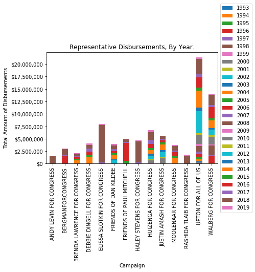


### Representative disbursements per campaign, [2014, 2020]

Narrow the scope of the data analysis to just after 2014. 


```python
post_2014 = df[df.report_year >=2014]
```


```python
pd.options.display.max_rows = 999
```


```python
disbursements_2014 = post_2014.groupby(["committee_name", "report_year"]).sum()["disbursement_amount"]
disbursements_2014
```


    committee_name                report_year
    ANDY LEVIN FOR CONGRESS       2017             11198.98
                                  2018           1456606.76
                                  2019             53770.22
    BERGMANFORCONGRESS            2016           1447111.79
                                  2017            376621.60
                                  2018           1106439.31
                                  2019            131747.52
    BRENDA LAWRENCE FOR CONGRESS  2014            668684.59
                                  2015            295317.63
                                  2016            399013.56
                                  2017            257542.50
                                  2018            317589.56
                                  2019            119847.75
    DEBBIE DINGELL FOR CONGRESS   2014           1292527.95
                                  2015            378323.23
                                  2016            752824.49
                                  2017            648685.51
                                  2018            707601.68
                                  2019            313719.68
    ELISSA SLOTKIN FOR CONGRESS   2017            248133.75
                                  2018           7501163.65
                                  2019            207897.17
    FRIENDS OF DAN KILDEE         2014            776086.54
                                  2015            386119.17
                                  2016            431964.78
                                  2017            455039.40
                                  2018            717822.65
                                  2019            282347.24
    FRIENDS OF PAUL MITCHELL      2015            534462.97
                                  2016           3652030.33
                                  2017            143725.08
                                  2018            563320.64
                                  2019             63432.81
    HALEY STEVENS FOR CONGRESS    2017            241910.20
                                  2018           4185226.50
                                  2019            299054.07
    HUIZENGA FOR CONGRESS         2014            635617.33
                                  2015            436039.58
                                  2016            873919.23
                                  2017            790903.52
                                  2018           1586154.37
                                  2019            332914.44
    JUSTIN AMASH FOR CONGRESS     2014           1135229.17
                                  2015            395222.14
                                  2016            400206.34
                                  2017            310323.60
                                  2018            455952.79
                                  2019            173792.62
    MOOLENAAR FOR CONGRESS        2014           1158331.45
                                  2015            346343.86
                                  2016            781708.71
                                  2017            328951.00
                                  2018            895944.49
                                  2019            211988.06
    RASHIDA TLAIB FOR CONGRESS    2018           1602430.94
                                  2019            156453.23
    UPTON FOR ALL OF US           2014           3413809.84
                                  2015            671551.02
                                  2016           2015112.28
                                  2017            779387.60
                                  2018           2983531.43
                                  2019            242617.85
    WALBERG FOR CONGRESS          2014           1605998.27
                                  2015            364163.43
                                  2016           2346240.80
                                  2017            360449.78
                                  2018           2036657.67
                                  2019            201886.88
    Name: disbursement_amount, dtype: float64


```python
ax = disbursements_2014.unstack().plot(kind='bar', stacked=True)
plt.xlabel("Campaign")
fmt = '${x:,.0f}'
tick = mtick.StrMethodFormatter(fmt)
ax.yaxis.set_major_formatter(tick) 
plt.legend(loc='center left', bbox_to_anchor=(1.0, 0.5))
plt.ylabel("Total Amount of Disbursements")
plt.title("Total Disbursements By Campaign [2014, 2020]")
```


    Text(0.5, 1.0, 'Total Disbursements By Campaign [2014, 2020]')


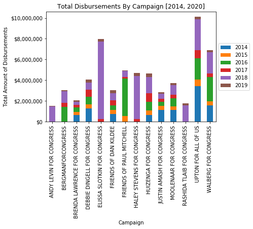


# "Lavish - But Legal?"

A deep dive into questionably personal charges by all Michigan Representatives.

Following POLITICO's 2014 example with Aaron Shock.


>> Feb. 9 - Following the Post report and another revelation from USA Today, POLITICO details Schock’s lavish—but legal—spending at pricey hotels in Las Vegas, San Francisco, Miami Beach and other posh destinations for campaign purposes.
“In addition to staying at expensive hotels, Schock also has spent more than $90,000 in campaign dollars on private air charters, an unusually high sum for a rank-and-file member of the House,” POLITICO reported at the time. 

- [Schock resigns: The embattled congressman quits after POLITICO presses him on tens of thousands of dollars in questionable reimbursements.](https://www.politico.com/story/2015/03/aaron-schock-resigns-116153)


```python
lavish_data=dict()
lavish_categories = ["hotel", "motel"]
for lavish_category in lavish_categories:
    lavish_data[lavish_category] = post_2014[
        post_2014.disbursement_description.str.contains(
            lavish_category,
            case=False,
            na=False,
        )
    ]
lavish_keywords = ["holiday inn", "disney", "food"]
for lavish_category in lavish_keywords:
    lavish_data[lavish_category] = post_2014[
        post_2014.recipient_name.str.contains(
            lavish_category,
            case=False,
            na=False,
        )
    ]
```

### Hotels

Post 2014 disbursements for Hotels by Representative, all data:


```python
ax = lavish_data["hotel"].groupby(["committee_name"]).sum()["disbursement_amount"].plot(kind='bar')
plt.xlabel("Campaign")
fmt = '${x:,.0f}'
tick = mtick.StrMethodFormatter(fmt)
ax.yaxis.set_major_formatter(tick) 
plt.ylabel("Total Amount of Disbursements")
#plt.legend(loc='center left', bbox_to_anchor=(1.0, 0.5))
plt.title("Value of Hotel Disbursements by Campaign and State. [2014, 2020]")
```


    Text(0.5, 1.0, 'Value of Hotel Disbursements by Campaign and State. [2014, 2020]')


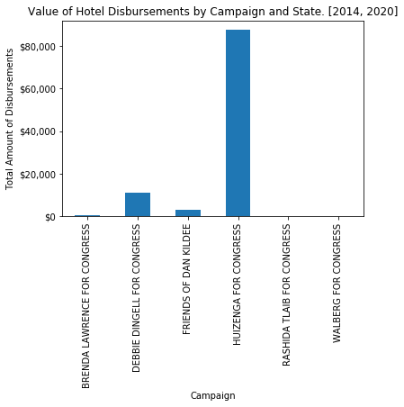


Post 2014 disbursements for Hotels by Representative, broken down by state:


```python
hotel_state = lavish_data["hotel"].groupby(["committee_name", "recipient_state"]).sum()["disbursement_amount"]
hotel_state
```


    committee_name                recipient_state
    BRENDA LAWRENCE FOR CONGRESS  VA                   673.48
    DEBBIE DINGELL FOR CONGRESS   CA                  1427.44
                                  MI                  6675.72
                                  NM                   409.79
                                  NV                   208.90
                                  NY                   687.88
                                  VA                  1682.00
    FRIENDS OF DAN KILDEE         MD                  2642.17
                                  MI                   179.74
                                  TX                   176.50
    HUIZENGA FOR CONGRESS         DC                 12189.00
                                  FL                  8070.03
                                  GA                  6550.59
                                  IL                  6515.17
                                  MA                  3025.25
                                  MD                   214.76
                                  MI                 35428.33
                                  NH                  1204.65
                                  NY                  6355.72
                                  OH                  4561.00
                                  PA                   881.04
                                  VA                  2401.86
    RASHIDA TLAIB FOR CONGRESS    TX                    38.10
    WALBERG FOR CONGRESS          NY                   298.37
    Name: disbursement_amount, dtype: float64


```python
ax = hotel_state.unstack().plot(kind='bar', stacked=True)
plt.xlabel("Campaign")
fmt = '${x:,.0f}'
tick = mtick.StrMethodFormatter(fmt)
ax.yaxis.set_major_formatter(tick) 
plt.ylabel("Total Amount of Disbursements")
plt.legend(loc='center left', bbox_to_anchor=(1.0, 0.5))
plt.title("Value of Hotel Disbursements by Campaign and State")
```


    Text(0.5, 1.0, 'Value of Hotel Disbursements by Campaign and State')


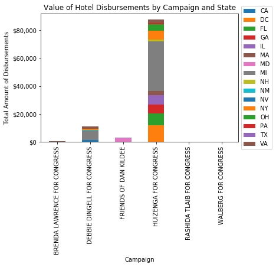


### Disney

> Even miracles take a little time." - Fairy Godmother (Cinderella)

Post 2014 disbursements to 'Disney' by Representative, all data.

[**If a committee_name is not listed, the spending is $0.00**]


```python
disney_disbursements = lavish_data["disney"].groupby(["committee_name"]).sum()["disbursement_amount"]
disney_disbursements
```


    committee_name
    HUIZENGA FOR CONGRESS    8655.36
    Name: disbursement_amount, dtype: float64


This plot is pretty pointless then, but in case anyone wants to see ALL Michigan Representative [2014, 2020] disbursements to recipients with 'disney' in their name.


```python
ax = disney_disbursements.plot(kind='bar')
plt.xlabel("Campaign")
fmt = '${x:,.0f}'
tick = mtick.StrMethodFormatter(fmt)
ax.yaxis.set_major_formatter(tick) 
plt.ylabel("Total Amount of Disbursements")
#plt.legend(loc='center left', bbox_to_anchor=(1.0, 0.5))
plt.title("Value of Disney Disbursements by Campaign. [2014, 2020]")
```


    Text(0.5, 1.0, 'Value of Disney Disbursements by Campaign. [2014, 2020]')


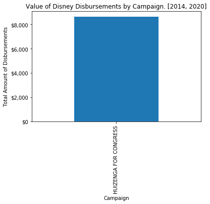


```python
# Pull this out.
disney = lavish_data["disney"]
```

### Rep Bill Huizenga's Disney Spending.

Breakdowns of HUIZENGA FOR CONGRESS's Disney disbursement by various FEC category.


```python
groupings = [
    "disbursement_description",
    "disbursement_purpose_category",
    "disbursement_date",
    "report_year",
]
for grouping in groupings:
    print("Huizenga Disney Disbursement: {}".format(grouping))
    print(disney[grouping])
    print()
```

    Huizenga Disney Disbursement: disbursement_description
    3700    CAMPAIGN EVENT: HOTEL FOR CAMPAIGN EVENT
    4002    CAMPAIGN EVENT: HOTEL FOR CAMPAIGN EVENT
    4065    CAMPAIGN EVENT: HOTEL FOR CAMPAIGN EVENT
    4116    CAMPAIGN EVENT: HOTEL FOR CAMPAIGN EVENT
    6179                                 EVENT MEALS
    6226                               EVENT TICKETS
    6232                               EVENT TICKETS
    6269                               EVENT TICKETS
    6351                                EVENT TICKET
    6363                                EVENT TICKET
    Name: disbursement_description, dtype: object
    
    Huizenga Disney Disbursement: disbursement_purpose_category
    3700     OTHER
    4002     OTHER
    4065     OTHER
    4116     OTHER
    6179    TRAVEL
    6226     OTHER
    6232     OTHER
    6269     OTHER
    6351     OTHER
    6363     OTHER
    Name: disbursement_purpose_category, dtype: object
    
    Huizenga Disney Disbursement: disbursement_date
    3700    2014-03-19 00:00:00
    4002    2014-03-19 00:00:00
    4065    2014-03-19 00:00:00
    4116    2014-03-19 00:00:00
    6179    2018-07-06 00:00:00
    6226    2018-07-06 00:00:00
    6232    2018-07-06 00:00:00
    6269    2018-06-06 00:00:00
    6351    2018-05-08 00:00:00
    6363    2018-05-29 00:00:00
    Name: disbursement_date, dtype: object
    
    Huizenga Disney Disbursement: report_year
    3700    2014
    4002    2014
    4065    2014
    4116    2014
    6179    2018
    6226    2018
    6232    2018
    6269    2018
    6351    2018
    6363    2018
    Name: report_year, dtype: int64
    


### Michigan Representative Michigan Hotel Spending [2014, 2020]

How often do Michigan Representatives spend time at hotels in Michigan?


```python
hotels = lavish_data["hotel"]

mi_hotels = hotels[hotels.recipient_state == "MI"]

mi_hotels_by_committee = mi_hotels.groupby(["committee_name"]).sum()["disbursement_amount"]
mi_hotels_by_committee
```


    committee_name
    DEBBIE DINGELL FOR CONGRESS     6675.72
    FRIENDS OF DAN KILDEE            179.74
    HUIZENGA FOR CONGRESS          35428.33
    Name: disbursement_amount, dtype: float64


#### Other ways of looking at the data.

We are exhausted. Here's a bunch of breakdowns on how those [2014, 2020] Michigan hotel disbursements were spent.


```python
mi_hotels.groupby(["committee_name", "recipient_city"]).sum()["disbursement_amount"]
```


    committee_name               recipient_city 
    DEBBIE DINGELL FOR CONGRESS  ANN ARBOR           2324.34
                                 DEARBORN             133.12
                                 DETROIT             1622.65
                                 MACKINAC ISLAND     2296.98
                                 TAYLOR               298.63
    FRIENDS OF DAN KILDEE        DETROIT              179.74
    HUIZENGA FOR CONGRESS        DETROIT              783.08
                                 GRAND RAPIDS        1268.47
                                 HOLLAND              859.14
                                 JACKSON              214.18
                                 LANSING             1495.80
                                 MACKINAC ISLAND    22469.77
                                 NOVI                 346.40
                                 PORTAGE              451.00
                                 THOMPSONVILLE        793.19
                                 TRAVERSE CITY       2414.79
                                 ZEELAND             4332.51
    Name: disbursement_amount, dtype: float64


```python
mi_hotels.groupby(["committee_name", "recipient_city", "report_year"]).sum()["disbursement_amount"]
```


    committee_name               recipient_city   report_year
    DEBBIE DINGELL FOR CONGRESS  ANN ARBOR        2015            2324.34
                                 DEARBORN         2018             133.12
                                 DETROIT          2016             687.70
                                                  2018             934.95
                                 MACKINAC ISLAND  2017             354.96
                                                  2018            1942.02
                                 TAYLOR           2018             298.63
    FRIENDS OF DAN KILDEE        DETROIT          2014             179.74
    HUIZENGA FOR CONGRESS        DETROIT          2014             230.00
                                                  2015             553.08
                                 GRAND RAPIDS     2014             593.96
                                                  2016             499.29
                                                  2018             175.22
                                 HOLLAND          2014             859.14
                                 JACKSON          2018             214.18
                                 LANSING          2016             734.25
                                                  2017             761.55
                                 MACKINAC ISLAND  2015           10421.38
                                                  2016            1156.81
                                                  2017           10891.58
                                 NOVI             2014             346.40
                                 PORTAGE          2014             451.00
                                 THOMPSONVILLE    2014             793.19
                                 TRAVERSE CITY    2016            2414.79
                                 ZEELAND          2016            3840.33
                                                  2017             492.18
    Name: disbursement_amount, dtype: float64


```python
mi_hotels.groupby(["committee_name", "recipient_name"]).sum()["disbursement_amount"]
```


    committee_name               recipient_name             
    DEBBIE DINGELL FOR CONGRESS  GRAND HOTEL                     1942.02
                                 HILTON GARDEN INN ANN ARBOR     2324.34
                                 MGM GRAND DETROIT               1622.65
                                 MURRAY HOTEL                     354.96
                                 RED ROOF INN                     298.63
                                 THE HENRY HOTEL                  133.12
    FRIENDS OF DAN KILDEE        GREEKTOWN CASINO HOTEL           179.74
    HUIZENGA FOR CONGRESS        AMWAY GRAND PLAZA HOTEL          674.51
                                 CAMBRIA SUITES                  2109.00
                                 CHIPPEWA HOTEL                  3466.08
                                 CITY FLATS HOTEL                 859.14
                                 COMFORT INN                      305.79
                                 CRYSTAL MOUNTAIN                 793.19
                                 DELTA AIR LINES                  451.00
                                 DETROIT ATHLETIC CLUB            553.08
                                 FAIRFIELD INN                    214.18
                                 GRAND HOTEL                    12407.73
                                 HUIZENGA, NATALIE               3840.33
                                 HUIZENGA, WILLIAM P              492.18
                                 LAKE VIEW HOTEL                 6050.76
                                 RADISSON HOTELS                 1495.80
                                 RED ROOF INN                     593.96
                                 SHERATON                         346.40
                                 THE ISLAND HOUSE                 545.20
                                 WESTIN BOOK CADILLAC             230.00
    Name: disbursement_amount, dtype: float64


```python
mi_hotels.groupby(["committee_name", "recipient_name"]).sum()["disbursement_amount"].unstack().plot(kind='bar', stacked=True)
plt.xlabel("Campaign")
fmt = '${x:,.0f}'
tick = mtick.StrMethodFormatter(fmt)
ax.yaxis.set_major_formatter(tick) 
plt.legend(loc='center left', bbox_to_anchor=(1.0, 0.5))
plt.ylabel("Total Amount of Disbursements")
plt.title("Michigan Hotel Spending by Campaign & Property")
```


    Text(0.5, 1.0, 'Michigan Hotel Spending by Campaign & Property')


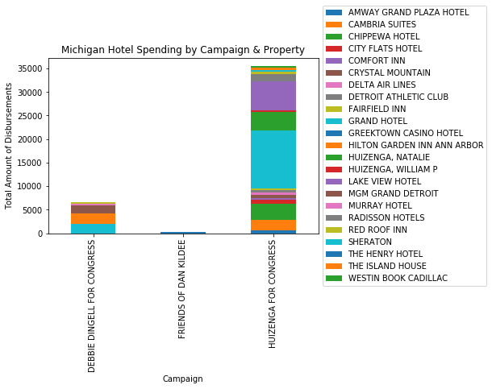


# Michigan Representatives Disbursements to Immediate Family [1993, 2020].

[Going back to the *entire* dataset. So this includes *all* of Fred Upton's disbursements.]


```python
# The names are a mess, clean them up and
# add a column for relationship to the representative.

def recipient_parsing(raw_name):
    # Ignore if it's paying back a committee.
    if "FOR CONGRESS" in raw_name:
        return None, None
    if "WALBERG" in raw_name:
        if "SU" in raw_name:
            return "WALBERG, SUSAN", "WIFE"
        if "CALEB" in raw_name:
            return "WALBERG, CALEB", "SON"
        if "CONG." in raw_name:
            return None, None
        if "TIM" in raw_name:
            return "WALBERG, TIM", "SELF"
    if "HUIZ" in raw_name:
        if "NA" in raw_name:
            return "HUIZENGA, NATALIE", "WIFE"
        if "GARRE" in raw_name:
            return "HUIZENGA, GARRETT", "SON"
        if "BILL" in raw_name or "WILL" in raw_name:
            return "HUIZENGA, BILL", "SELF"
    if "AMASH" in raw_name:
        if "JUSTIN" in raw_name:
            return "AMASH, JUSTIN", "SELF"
    if "LAWRENCE" in raw_name:
        if "BRENDA" in raw_name:
            return "LAWRENCE, BRENDA", "SELF"
    if "DINGELL" in raw_name:
        if "DEBBIE" in raw_name:
            return "DINGELL, DEBBIE", "SELF"
    if "MITCHELL" in raw_name:
        if "PAUL" in raw_name:
            return "MITCHELL, PAUL III", "SELF"
    if "BERGMAN" in raw_name:
        if "JOHN" in raw_name:
            return "BERGMAN, JOHN", "SELF"
    if "STEVENS" in raw_name:
        if "HALEY" in raw_name:
            return "STEVENS, HALEY", "SELF"
    if "LEVIN" in raw_name:
        if "ANDY" in raw_name:
            return "LEVIN, ANDY", "SELF"
    if "TLAIB" in raw_name:
        if "RASHIDA" in raw_name:
            return "TLAIB, RASHIDA", "SELF"
    return None, None
    raise Exception(raw_name)
    
recipient_names_clean = list()
relationships=list()
for recipient in df.recipient_name:
    recipient_name_clean, relationship = recipient_parsing(recipient)
    recipient_names_clean.append(recipient_name_clean)
    relationships.append(relationship)

df['recipient_name_clean'] = recipient_names_clean 
df['relationship'] = relationships
```

Total *number* of disbursements to Michigan Representative relatives by relationship to representative.

## Disbursements made to immediate family, all 14 Michigan Reps (combined)


```python
# Michiga
a1=df["relationship"].value_counts()
a1
```


    SELF    362
    WIFE    239
    SON      11
    Name: relationship, dtype: int64


Total *value* ($$) of disbursements to Michigan Representative relatives by relationship to representative.

Michigan total disbursements.


```python
a2 = df.groupby(["relationship"]).sum()["disbursement_amount"]
a2
```


    relationship
    SELF    581864.13
    SON       2345.80
    WIFE     85530.06
    Name: disbursement_amount, dtype: float64


```python
ax=a1.plot.bar()
plt.xlabel("Disbursement Relationship")
plt.ylabel("Number of Disbursements")
plt.title("# of Disbursements vs Relationship to Representative")
```


    Text(0.5, 1.0, '# of Disbursements vs Relationship to Representative')


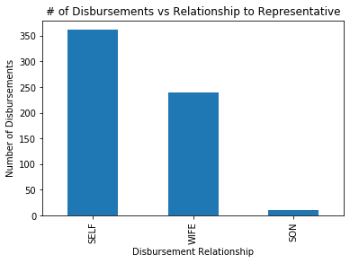


```python
ax=a2.plot.bar()
plt.xlabel("Disbursement Relationship")
plt.ylabel("Number of Disbursements")
plt.title("Value ($) of Disbursements vs Relationship to Representative")
```


    Text(0.5, 1.0, 'Value ($) of Disbursements vs Relationship to Representative')


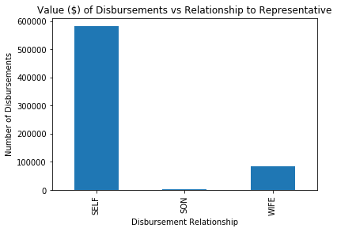


## Michigan Representatives Family Disbursement by representative & Relationship [1993, 2000]

Number (#) of disbursements current Michigan Representatives made to members of their immediate family by representative.


```python
a=df.groupby(['committee_name','relationship']).size()
a
```


    committee_name                relationship
    ANDY LEVIN FOR CONGRESS       SELF              4
    BERGMANFORCONGRESS            SELF              6
    BRENDA LAWRENCE FOR CONGRESS  SELF              2
    DEBBIE DINGELL FOR CONGRESS   SELF             15
    FRIENDS OF PAUL MITCHELL      SELF             15
    HALEY STEVENS FOR CONGRESS    SELF              1
    HUIZENGA FOR CONGRESS         SELF            188
                                  SON               9
                                  WIFE            136
    JUSTIN AMASH FOR CONGRESS     SELF             25
    RASHIDA TLAIB FOR CONGRESS    SELF             32
    WALBERG FOR CONGRESS          SELF             74
                                  SON               2
                                  WIFE            103
    dtype: int64


```python
ax = a.unstack().plot(kind='bar', stacked=True)
plt.ylabel("Number of Disbursements")
plt.title("Number of Disbursements by Committee & Relationship.")
```


    Text(0.5, 1.0, 'Number of Disbursements by Committee & Relationship.')


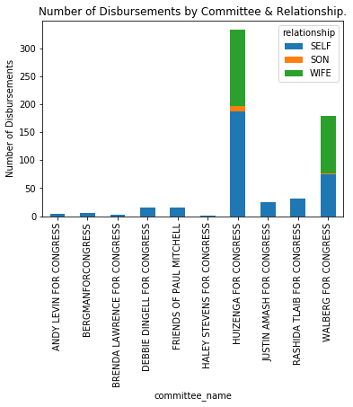


Value ($) of disbursements current Michigan Representatives made to members of their immediate family grouped by representative and relationship to representative.


```python
a=df.groupby(['committee_name','relationship']).sum()["disbursement_amount"]
a
```


    committee_name                relationship
    ANDY LEVIN FOR CONGRESS       SELF             69055.45
    BERGMANFORCONGRESS            SELF             24320.00
    BRENDA LAWRENCE FOR CONGRESS  SELF               920.40
    DEBBIE DINGELL FOR CONGRESS   SELF              8231.19
    FRIENDS OF PAUL MITCHELL      SELF             51695.01
    HALEY STEVENS FOR CONGRESS    SELF               246.98
    HUIZENGA FOR CONGRESS         SELF             79018.42
                                  SON               1745.80
                                  WIFE             53605.31
    JUSTIN AMASH FOR CONGRESS     SELF            239453.69
    RASHIDA TLAIB FOR CONGRESS    SELF             59115.90
    WALBERG FOR CONGRESS          SELF             49807.09
                                  SON                600.00
                                  WIFE             31924.75
    Name: disbursement_amount, dtype: float64


```python
ax = a.unstack().plot(kind='bar', stacked=True)
fmt = '${x:,.0f}'
tick = mtick.StrMethodFormatter(fmt)
ax.yaxis.set_major_formatter(tick) 
plt.ylabel("Total Amount of Disbursements")
plt.title("Value of Disbursements by Committee & Relationship.")
```


    Text(0.5, 1.0, 'Value of Disbursements by Committee & Relationship.')


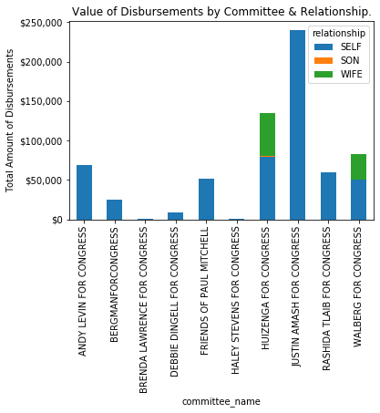


### Michigan Representative Self Loan Repayments Data

[Addressing Justin Amash's 200100.00 value]

>> Candidates may loan their personal funds for campaign purposes. When they do so, they are making contributions to their campaigns. Unlike other contributions, these candidate contributions are not subject to any limits but are subject to additional reporting. Moreover, timing restrictions apply to the repayment of personal loans aggregating more than $250,000 for an election.

- [Personal loans from the candidate [fec.gov]](https://www.fec.gov/help-candidates-and-committees/handling-loans-debts-and-advances/personal-loans-candidate/)

Total ($) self disbursement for loan-repayment purposes by representative.


```python
self_disbursements = df[df.relationship == "SELF"]
self_disbursements[self_disbursements.disbursement_purpose_category == "LOAN-REPAYMENTS"].groupby(['committee_name','disbursement_purpose_category']).sum()["disbursement_amount"]
```


    committee_name             disbursement_purpose_category
    ANDY LEVIN FOR CONGRESS    LOAN-REPAYMENTS                   65000.0
    BERGMANFORCONGRESS         LOAN-REPAYMENTS                   19320.0
    HUIZENGA FOR CONGRESS      LOAN-REPAYMENTS                   25000.0
    JUSTIN AMASH FOR CONGRESS  LOAN-REPAYMENTS                  200100.0
    WALBERG FOR CONGRESS       LOAN-REPAYMENTS                   24000.0
    Name: disbursement_amount, dtype: float64


Now that we've displayed the data, remove it to focus on *all other* family disbursements.

### Michigan Representative Disbursement, sans Loan Repayments

Value ($) of disbursements current Michigan Representatives made to members of their immediate family grouped by representative and relationship to representative with loan repayment data removed.


```python
df_nl = df[df.disbursement_purpose_category != "LOAN-REPAYMENTS"]
a = df_nl.groupby(['committee_name','relationship']).sum()["disbursement_amount"]
a
```


    committee_name                relationship
    ANDY LEVIN FOR CONGRESS       SELF             4055.45
    BERGMANFORCONGRESS            SELF             5000.00
    BRENDA LAWRENCE FOR CONGRESS  SELF              920.40
    DEBBIE DINGELL FOR CONGRESS   SELF             8231.19
    FRIENDS OF PAUL MITCHELL      SELF            51695.01
    HALEY STEVENS FOR CONGRESS    SELF              246.98
    HUIZENGA FOR CONGRESS         SELF            54018.42
                                  SON              1745.80
                                  WIFE            53605.31
    JUSTIN AMASH FOR CONGRESS     SELF            39353.69
    RASHIDA TLAIB FOR CONGRESS    SELF            59115.90
    WALBERG FOR CONGRESS          SELF            25807.09
                                  SON               600.00
                                  WIFE            31924.75
    Name: disbursement_amount, dtype: float64


```python
df_nl = df[df.disbursement_purpose_category != "LOAN-REPAYMENTS"]
a = df_nl.groupby(['committee_name','relationship']).sum()["disbursement_amount"]
a
```


    committee_name                relationship
    ANDY LEVIN FOR CONGRESS       SELF             4055.45
    BERGMANFORCONGRESS            SELF             5000.00
    BRENDA LAWRENCE FOR CONGRESS  SELF              920.40
    DEBBIE DINGELL FOR CONGRESS   SELF             8231.19
    FRIENDS OF PAUL MITCHELL      SELF            51695.01
    HALEY STEVENS FOR CONGRESS    SELF              246.98
    HUIZENGA FOR CONGRESS         SELF            54018.42
                                  SON              1745.80
                                  WIFE            53605.31
    JUSTIN AMASH FOR CONGRESS     SELF            39353.69
    RASHIDA TLAIB FOR CONGRESS    SELF            59115.90
    WALBERG FOR CONGRESS          SELF            25807.09
                                  SON               600.00
                                  WIFE            31924.75
    Name: disbursement_amount, dtype: float64


```python
ax = a.unstack().plot(kind='bar', stacked=True)
plt.xlabel("Campaign")
fmt = '${x:,.0f}'
tick = mtick.StrMethodFormatter(fmt)
ax.yaxis.set_major_formatter(tick) 
plt.legend(title="Relationship", loc='center left', bbox_to_anchor=(1.0, 0.5))
plt.ylabel("Total Amount of Disbursements [$]")
plt.title("Family Disbusement [w/o Loan Repayment]")
```


    Text(0.5, 1.0, 'Family Disbusement [w/o Loan Repayment]')


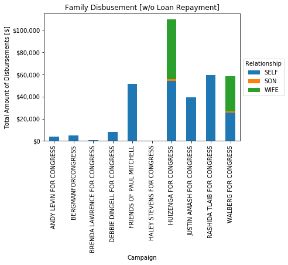


# Michigan Representative Family Disbursements, By Relationship to Rep.


```python
self_disbursements = df_nl[df_nl.relationship == "SELF"]
# No Husbands were represented in disbursements.
wife_disbursements = df_nl[df_nl.relationship == "WIFE"]
son_disbursements = df_nl[df_nl.relationship == "SON"]
```

## Self Disbursement Purposes


```python
a = self_disbursements.groupby(['committee_name','disbursement_purpose_category']).sum()["disbursement_amount"]
a
```


    committee_name                disbursement_purpose_category
    ANDY LEVIN FOR CONGRESS       TRAVEL                            4055.45
    BERGMANFORCONGRESS            OTHER                             5000.00
    BRENDA LAWRENCE FOR CONGRESS  FUNDRAISING                        270.40
                                  MATERIALS                          650.00
    DEBBIE DINGELL FOR CONGRESS   MATERIALS                         1037.00
                                  OTHER                             7122.04
                                  TRAVEL                              72.15
    FRIENDS OF PAUL MITCHELL      FUNDRAISING                       1349.70
                                  OTHER                            50345.31
    HALEY STEVENS FOR CONGRESS    OTHER                              246.98
    HUIZENGA FOR CONGRESS         MATERIALS                         2176.88
                                  OTHER                            49202.96
                                  TRAVEL                            2638.58
    JUSTIN AMASH FOR CONGRESS     MATERIALS                         3598.00
                                  OTHER                            35755.69
    RASHIDA TLAIB FOR CONGRESS    ADMINISTRATIVE                   50524.32
                                  MATERIALS                         1573.81
                                  OTHER                             7017.77
    WALBERG FOR CONGRESS          OTHER                            25807.09
    Name: disbursement_amount, dtype: float64


```python
ax = a.unstack().plot(kind='bar', stacked=True)
plt.xlabel("Campaign")
fmt = '${x:,.0f}'
tick = mtick.StrMethodFormatter(fmt)
ax.yaxis.set_major_formatter(tick) 
plt.legend(title="Disbursement Purpose", loc='center left', bbox_to_anchor=(1.0, 0.5))
plt.ylabel("Total Amount of Disbursements")
plt.title("Self Disbusement Spending [w/o Loan Repayment]")
```


    Text(0.5, 1.0, 'Self Disbusement Spending [w/o Loan Repayment]')


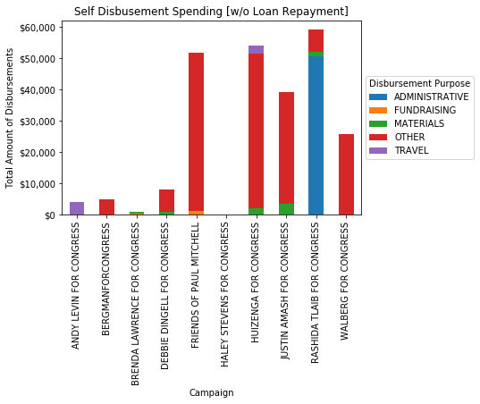


## Wife Disbursement Purposes


```python
a = wife_disbursements.groupby(['committee_name','disbursement_purpose_category']).sum()["disbursement_amount"]
a
```


    committee_name         disbursement_purpose_category
    HUIZENGA FOR CONGRESS  ADMINISTRATIVE                      66.55
                           MATERIALS                         6057.87
                           OTHER                            46627.41
                           TRAVEL                             853.48
    WALBERG FOR CONGRESS   ADMINISTRATIVE                    5142.10
                           MATERIALS                         1054.39
                           OTHER                            25728.26
    Name: disbursement_amount, dtype: float64


```python
ax = a.unstack().plot(kind='bar', stacked=True)
plt.xlabel("Campaign")
fmt = '${x:,.0f}'
tick = mtick.StrMethodFormatter(fmt)
ax.yaxis.set_major_formatter(tick) 
plt.legend(title="Disbursement Purpose", loc='center left', bbox_to_anchor=(1.0, 0.5))
plt.ylabel("Total Amount of Disbursements")
plt.title("Wife Disbusement Spending [w/o Loan Repayment]")
```


    Text(0.5, 1.0, 'Wife Disbusement Spending [w/o Loan Repayment]')


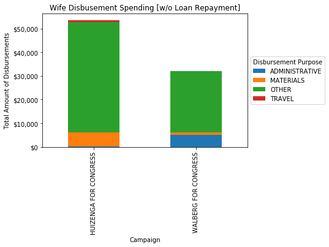


## Michigan Representative Self Disbursement by Disbursement Description

The FEC disbursement description is much more detailed than the above 'purpose'. Display non-loan repayment disbursements each representative gave themselves, by committee and disbursement description.


```python
self_disbursements.groupby(['committee_name','disbursement_description']).sum()["disbursement_amount"]
```


    committee_name                disbursement_description                                     
    ANDY LEVIN FOR CONGRESS       TRAVEL REIMBURSEMENT                                              4055.45
    BERGMANFORCONGRESS            IN-KIND - CREDIT CARD PAYMENT                                     5000.00
    BRENDA LAWRENCE FOR CONGRESS  CATERING REIMBURSEMENT                                             270.40
                                  REIMBURSEMENT OF CBC EVENT FOOD EXPENSE                            650.00
    DEBBIE DINGELL FOR CONGRESS   MEALS                                                               72.15
                                  MILEAGE                                                            446.27
                                  OFFICIALLY CONNECTED - MEMBERSHIP REIMBURSEMENT                     50.00
                                  REIMBURSEMENT                                                     5639.13
                                  REIMBURSEMENT - REFERENCE BOOK FOR OFFICE                           84.91
                                  REIMBURSEMENT FOR MEMBERSHIP                                       300.00
                                  RESIDENTIAL SECURITY EXPENSES                                     1037.00
                                  WALL HANGINGS - OFFICIALLY CONNECTED                               601.73
    FRIENDS OF PAUL MITCHELL      IN-KIND:4H SPONSORSHIP                                            2272.20
                                  IN-KIND:AIRFARE                                                  20995.45
                                  IN-KIND:CAMPAIGN EVENT VENUE                                      9000.00
                                  IN-KIND:CATERING                                                  1349.70
                                  IN-KIND:FOOD & BEVERAGE                                             16.11
                                  IN-KIND:GIFTS & MEMENTOS                                          3806.68
                                  IN-KIND:INKIND                                                      18.00
                                  IN-KIND:NOTARY                                                      15.00
                                  IN-KIND:PARADE CANDY                                               181.87
                                  IN-KIND:PARADE FEE                                                  40.00
                                  IN-KIND:POLLING                                                  14000.00
    HALEY STEVENS FOR CONGRESS    REIMBURSEMENT (VENDORS THAT AGGREGATE OVER $200 LISTED BELOW)      246.98
    HUIZENGA FOR CONGRESS         ADVERTISING: REIMBURSEMENT FOR FLAGS                               128.80
                                  ADVERTISING: REIMBURSEMENT FOR STAMPS                              440.00
                                  BREAKFAST MEETING REIMBURSEMENT                                     20.61
                                  CAMPAIGN DINNER MEETING                                             20.90
                                  CAMPAIGN DINNER MEETING REIMBURSEMENT                              175.31
                                  CAMPAIGN DINNER MEETINGS                                           185.08
                                  CAMPAIGN DINNER REIMBURSEMENT                                      522.65
                                  CAMPAIGN EVENT TICKET REIMBURSEMENT                                 50.50
                                  CAMPAIGN LUNCH MEETING REIM.                                       184.82
                                  EXPENSE REIMBURSEMENT                                              942.13
                                  FLAGS FOR VARIOUS ORGANIZATION                                     409.25
                                  FOOD FOR CAMPAIGN EVENT                                            636.77
                                  GOLF OUTING EXPENSES                                               166.95
                                  HOTEL & MEAL REIMBURSEMENT FOR CAMPAIGN MEETINGS                   492.18
                                  LUNCH MEETING REIMBURSEMENT                                         16.78
                                  MEAL AND TAXI REIMBURSEMENT                                        191.02
                                  MEAL REIMBURSEMENT                                                 884.66
                                  MEALS & EXPENSE REIMBURSEMENT                                      313.64
                                  MILEAGE REIMBURSEMENT                                            19285.18
                                  OVERTIME CHARGE & TIP                                              170.00
                                  PARKING & CAMPAIGN DINNER MEET                                      85.82
                                  PARKING & MEAL REIMBURSEMENT                                       133.57
                                  PARKING REIMBURSEMENT                                               28.75
                                  PARKING, TAXI & MEALS FOR DC T                                     141.27
                                  REIM OF CAMAPIGN DINNER MEETING                                     77.13
                                  REIMBURSEMENT FOR FLAGS                                            227.92
                                  REIMBURSEMENT FOR FOOD & OFFIC                                     204.01
                                  REIMBURSEMENT FOR MEAL EXPENSE                                     240.20
                                  REIMBURSEMENT OF EXPENSES                                          641.28
                                  REIMBURSEMENT OF SWEARING EXPE                                    3312.05
                                  SEE BELOW-NO ITEMIZATION NECESSARY                                  54.13
                                  SEE MEMO ENTRY                                                     247.56
                                  SUPPLIES FOR CAMPAIGN EVENT                                        182.41
                                  TAXI REIMBURSEMENT                                                 120.16
                                  TOLLS AND MEAL REIMBURSEMENT                                       242.04
                                  TRAVEL EXPENSE-NO ITEMIZATION REQUIRED                             341.27
                                  TRAVEL MILEAGE REIMBURSEMENT                                      1527.50
                                  TRAVEL MILEAGE REIUMBURSEMENT                                       39.00
                                  TRAVEL MILEAGE REIUMBUSEMENT                                        60.00
                                  TRAVEL: DELTA SKY LOUNGE                                            90.00
                                  TRAVEL: GAS & CAMPAIGN LUNCH MEETINGS                              126.31
                                  TRAVEL: MILEAGE                                                    147.00
                                  TRAVEL: MILEAGE & EXPENSE REIMBURSEMEN                              85.25
                                  TRAVEL: MILEAGE FOR BILL                                           903.75
                                  TRAVEL: MILEAGE REIMBURSEMENT                                    15487.03
                                  TRAVEL: MILEAGE REIMBURSEMENT FOR BILL                             693.00
                                  TRAVEL: PARKING & TAXI SERVICE                                      43.09
                                  TRAVEL: PLANE TICKET FOR NATALIE FOR D                             828.69
                                  TRAVEL: TRAVEL MILEAGE REIMBURSEMENT                              2028.25
                                  TRAVEL: TRAVEL MILEAGE RIEMBURSEMENT                               442.75
    JUSTIN AMASH FOR CONGRESS     IN-KIND - WEB ADS                                                  650.00
                                  IN-KIND:WEB ADS                                                  24581.61
                                  TRAVEL EXPENSE -- SEE MEMO                                         893.15
                                  TRAVEL EXPENSE--SEE MEMO                                          1562.45
                                  TRAVEL EXPENSES-SEE MEMO                                          1142.40
                                  WEB ADS                                                          10524.08
    RASHIDA TLAIB FOR CONGRESS    REIMBURSEMENT                                                     1117.17
                                  REIMBURSEMENT - PARKING                                             45.00
                                  REIMBURSEMENT - TRAVEL                                            5021.57
                                  REIMBURSEMENT - TRAVEL, THANK YOU, POSTAGE                        3528.66
                                  REIMBURSEMENT - WEBSITE                                            150.30
                                  REIMBURSEMENT FOR TRANSPORTATION                                   275.00
                                  REIMBURSEMENT FOR TRAVEL                                           137.00
                                  REIMBURSEMENT FOR TRAVEL EXPENSES                                 1573.81
                                  REIMBURSEMENT FOR TRAVEL, THANK YOU, AND POSTAGE                  1495.66
                                  REIMBURSEMENT FOR WEBSITE DOMAIN                                   119.88
                                  REIMBURSEMENTS                                                     151.85
                                  SALARY                                                           45500.00
    WALBERG FOR CONGRESS          MILEAGE                                                          19953.30
                                  REIMBURSEMENT: SEE BELOW                                           387.42
                                  TRAVEL: MILAGE                                                     240.80
                                  TRAVEL: MILEAGE                                                   5225.57
    Name: disbursement_amount, dtype: float64


```python
wife_disbursements.groupby(['committee_name','disbursement_description']).sum()["disbursement_amount"]
```


    committee_name         disbursement_description                       
    HUIZENGA FOR CONGRESS  CAMPAIGN EVENT: HOTEL FOR CAMPAIGN EVENT             341.22
                           CAMPAIGN EVENT: SPOUSES LOC RECEPTION               1046.19
                           CAMPAIGN EVENT: TICKET FOR EVENT                      75.00
                           CAMPAIGN LUNCH MEETING                                33.52
                           CAMPAIGN LUNCH REIMBURSEMENTS                        130.23
                           CAMPAIGN PLANE TICKET REIMBURSEMENT                  711.20
                           COMPUTER REPAIR                                       79.00
                           COMPUTER STORAGE                                      44.99
                           CONGRESSIONAL CLUB MEMBERSHIP                        650.00
                           COUSINS JERSEY REIMBURSEMENT                         421.85
                           EXPENSE REIMBURSEMENT FOR CAMPAIGN EVENT             262.89
                           EXPENSES FOR MICH GOP CONV                           148.05
                           FLAGS & MILEAGE REIMBURSEMENT                        307.22
                           FUND RAISING RENTAL EQUIPMENT FEE REIMBURSEMENT       34.98
                           INAUGURATION HOTEL                                  3840.33
                           INK CARTRIDGE & BILLS BIRTHDAY                       125.68
                           MEAL REIMBURSEMENT                                    45.32
                           MILEAGE REIMBURSEMENT                               8429.98
                           OFFICE SUPPLIES                                       31.57
                           PARTY SUPPLY REIMBURSEMENT FOR FUND RAISER           148.87
                           PARTY SUPPPLY REIMBURSEMENT FOR FUND RAISER           87.47
                           PLANE TICKET FOR CAMPAIGN EVENT                      152.00
                           PLANE TICKETS FOR CAMPAIGN EVENT                    2417.40
                           PLANE TICKETS REIMBURSEMENT                         5236.80
                           PLANE TICKETS REIMBURSEMENT FOR CAMPAIGN EVENT      6360.60
                           PLANTERS FOR PANCAKE BREAKFAST                        15.84
                           REIMBURSEMENT FOR CAMPAIGN EVENT                     255.23
                           REIMBURSEMENT FOR CAMPAIGN LODGING                   601.20
                           REIMBURSEMENT FOR CAMPAIGN TRAVEL EXPENSES          4928.00
                           REIMBURSEMENT FOR HOTEL EXPENS                       614.88
                           REIMBURSEMENT FOR MEALS                              206.96
                           REIMBURSEMENT FOR PLANE TICKET                       220.79
                           REIMBURSEMENT FOR PLANE TICKETS                     2919.80
                           SEE BELOW                                           4875.00
                           TRAVEL EXPENSES                                      104.05
                           TRAVEL MILEAGE REIMBURSEMENT                         120.00
                           TRAVEL: MILEAGE                                      288.75
                           TRAVEL: MILEAGE & PARKING REIMBURSEMEN               249.27
                           TRAVEL: MILEAGE FOR NATALIE                           63.00
                           TRAVEL: MILEAGE REIMBURSEMENT                       6541.68
                           TRAVEL: PARKING & TAXICAB REIMBURSEMEN                42.00
                           TRAVEL: PARKING FOR CAMPAIGN EVENT                    15.00
                           TRAVEL: TAXICAB & MILEAGE REIMBURSEMEN               134.87
                           TRAVEL: TOLLS REIMBURSEMENT                           30.33
                           TRAVEL: TRAVEL MILEAGE REIMBURSEMENT                 208.25
                           VOID OF PREVIOUS                                    -152.00
                           WEBSITE SETUP FEE REIMBURSEMENT                      160.05
    WALBERG FOR CONGRESS   CAMPAIGN EVENT: REIMBURSEMENT - SUPPLIES              68.80
                           FUNDRAISING: REIMBURSEMENT -SUPPLIES                 135.38
                           OTHER: REIMBURSEMENT - FOOD                          769.28
                           OTHER: REIMBURSEMENT - FOOD/SUPLIES                  246.97
                           OTHER: REIMBURSEMENT - FOOD/SUPPLIES                 241.30
                           OTHER: REIMBURSEMENT - PARKING/FOOD                   63.55
                           OTHER: REIMBURSEMENT - POSTAGE                      3130.00
                           OTHER: REIMBURSEMENT - SUPPLIES                      398.14
                           OTHER: REIMBURSEMENT - SUPPLIES/FOOD                 316.60
                           OTHER: REIMBURSEMENT - SUPPLIES/POSTAGE             2012.10
                           OTHER: REIMBURSEMENT - TRAVEL                        621.20
                           OTHER: REIMBURSEMENT SUPPLIES                        243.14
                           PETTY CASH                                           286.70
                           REIBURSEMENT: SEE BELOW                              348.96
                           REIMBURSE EXPENDITURES                               216.92
                           REIMBURSE EXPENSES                                    27.56
                           REIMBURSE FOOD                                       143.51
                           REIMBURSE FOOD EXPENSES                               26.94
                           REIMBURSE FUNDRAISER EXPENSES                         49.34
                           REIMBURSE GAS - AUG.                                 558.62
                           REIMBURSE GAS - JULY                                 757.42
                           REIMBURSE GAS - JUNE                                 592.47
                           REIMBURSE GAS - MAY                                  400.08
                           REIMBURSE UNITEM. EXPENSES                            88.47
                           REIMBURSE VARIOUS EXPENDITURES                       128.08
                           REIMBURSEMENT - SUPPLIES                             164.51
                           REIMBURSEMENT -FOOD                                   71.80
                           REIMBURSEMENT -FOOD/SUPPLIES                         621.72
                           REIMBURSEMENT -FOOD/TRAVEL                            74.59
                           REIMBURSEMENT -FUEL/SUPPLIES                          76.73
                           REIMBURSEMENT -SUPPLIES                              463.61
                           REIMBURSEMENT:  SEE BELOW                            829.16
                           REIMBURSEMENT: SEE BELOW                           14302.24
                           REIMBURSEMENT:SEE BELOW                             2007.00
                           REIMBURSEMENTS: SEE BELOW                            630.00
                           REIMBURSMENT: SEE BELOW                              209.78
                           REIMBURSSEMENT: SEE BELOW                             85.00
                           REPAY VARIOUS EXPENDITURES                           189.34
                           VARIOUS EXPENDITURES                                 327.74
    Name: disbursement_amount, dtype: float64


### Sons


```python
son_disbursements.groupby(['committee_name','disbursement_description']).sum()["disbursement_amount"]
```


    committee_name         disbursement_description                  
    HUIZENGA FOR CONGRESS  MILEAGE REIMBURSEMENT                         1060.90
                           REIMBURSEMENT FOR CAMPAIGN TRAVEL EXPENSES     609.74
                           TRAVEL EXPENSES                                 75.16
    WALBERG FOR CONGRESS   PURCHASE COMPUTER                              300.00
                           SALARY                                         300.00
    Name: disbursement_amount, dtype: float64


# Sponsors

[Master of Science in Data Science and Analytic](https://www.gvsu.edu/grad/dsa/)

>> The Data Science and Analytics (M.S.) degree provides computer science students with the fundamental analytics background necessary to work with big and complex data sets in any discipline. It also allows a statistics or computing student to gain additional cross-disciplinary background, or for a student of any discipline to develop skills to solve data-intensive problems. This degree has applications to health, social, political, and environmental issues as science and technology disciplines. It provides training in key technical computer science areas while also developing business and communication skills.

>> The Data Science and Analytics (M.S.) degree is located in the School of Computing and Information Systems, within the Padnos College of Engineering and Computing. This program also collaborates closely with the Statistics Department.

[Muskegon Community College Journalism](https://www.muskegoncc.edu/degrees-and-certificates/areas-of-study/journalism/)

>> If you are interested in providing people with accurate information about the challenges, as well as triumphant moments that society is presented with, you may want to pursue journalism.  Journalists assist in the production and distribution of reports on current events.  Whether you are interested in writing for newspapers, magazines, news websites or preparing and gathering news to be broadcast, you can start your academic journey at MCC with general education courses for transfer toward a degree in journalism.

[The Calvin Alumni Association](https://calvin.edu/offices-services/alumni-association/)

>> You've tossed your cap but that doesn't mean your journey with Calvin has to end! The Alumni Association is here to serve you well beyond graduation. You can connect with other alumni worldwide, help strengthen our mission, stay inspired, and have a whole lot of fun along the way.

# Issues

https://github.com/issues

# References

- [Schock resigns: The embattled congressman quits after POLITICO presses him on tens of thousands of dollars in questionable reimbursements.](https://www.politico.com/story/2015/03/aaron-schock-resigns-116153) [POLITICO]
- [House ethics panel reviews complaint over GOP Rep. Bill Huizenga's campaign spending](https://www.politico.com/story/2019/09/30/ethics-bill-huizenga-campaign-spending-1519539) [POLITICO]
- [House Ethics Committee reviews campaign spending of Tlaib, Huizenga](https://www.michiganradio.org/post/house-ethics-committee-reviews-campaign-spending-tlaib-huizenga) [NPR]
- [Ethics committee reviewing complaints about Tlaib, Huizenga campaign spending](https://www.detroitnews.com/story/news/politics/2019/09/30/ethics-committee-reviewing-complaints-reps-tlaib-huizenga/3823225002/) [The Detroit News]
- [Ethics committee reviews campaign finance allegations against Tlaib, Huizenga](https://www.mlive.com/public-interest/2019/09/ethics-committee-reviews-campaign-finance-allegations-against-tlaib-huizenga.html) [MLive]
- [Bill Huizenga's Shady Campaign Finances May Have Finally Caught Up With Him In House Ethics Investigation](https://westmipolitics.blogspot.com/2019/10/bill-huizengas-shady-campaign-finances.html) [westmipolitics.blogspot.com]


